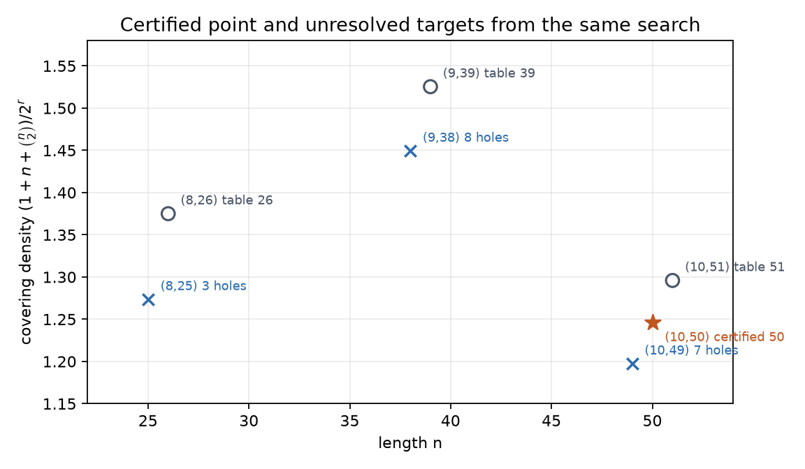

# How One Missing Column Became a Covering Code

## 0. What was missing

The asymptotic question in Green's Problem 40 is deliberately out of reach here. The useful finite question was narrower: could one write down a parity-check matrix that improves a documented small parameter, then make the covering claim independently checkable?

For a binary parity-check matrix, the entire problem lives in syndrome space. If its columns form a set $S\subset\mathbb F_2^r$, radius at most 2 means that every syndrome is either zero, a column, or the sum of two columns. The desired matrix was therefore a small additive basis of order two, with no zero or repeated columns.

That reformulation made the proof tiny. It did not make the search easy.

## 1. The attractive gaps that did not close

The first target was $(r,n)=(8,25)$. The documented length was 26, and deleting a single column would settle a conspicuous one-column gap. Random annealing repeatedly came close, but its best 25-set missed three of the 256 syndromes. CP-SAT and Z3 encodings also ran to their limits without a model or a refutation.

The second target was $(9,38)$, one column below the documented length 39. Here the monolithic SAT instance had roughly 130,000 pair auxiliaries. A five-minute CP-SAT run returned `UNKNOWN`. Reconstructing the classical Gabidulin 39-column set helped, but every direct deletion missed eight syndromes, and an exhaustive two-out/one-in neighborhood contained no solution.

These failures had names and numbers: three missed at $(8,25)$, eight missed at $(9,38)$, and `UNKNOWN` from every bounded exact run. None was a lower bound.

## 2. What the failures taught us

The near-solutions exposed a mismatch between the prettiest parameter gaps and the easiest search landscapes. At $r=8,n=25$, there are only
$$
1+25+\binom{25}{2}=326
$$
zero-, one-, and two-column representations for 256 syndromes. Almost every collision matters. The 26-column algebraic seed was also highly regular: deleting any column destroyed many uniquely covered syndromes.

The search needed more slack and a less rigid seed. The current table supplied both at redundancy 10. Its 51-column Kaikkonen--Rosendahl matrix has 1,327 representations for 1,024 syndromes and an explicit hexadecimal description. Deleting its least costly column left only 11 syndromes uncovered—worse as an absolute number than the $r=8$ residue, but with much more room to rearrange pair sums.

## 3. The click

The click was to stop asking which published bound was numerically closest and ask which seed had enough redundant representations to move.

The local-search state was a set of exactly 50 nonzero ten-bit columns. An array stored, for every syndrome, how many times it appeared as zero, a singleton, or a pair sum. Swapping one column changes only its singleton and the 49 pair sums involving it, so the uncovered count can be updated without recomputing all $\binom{50}{2}$ pairs.

Most proposals were targeted. Pick an uncovered syndrome $g$, then propose either $g$ itself or $g+s$ for a current column $s$; either choice has an immediate way to cover $g$, unless the compensating deletion breaks it again. Simulated annealing admitted the occasional uphill move needed to leave local minima.

With a fixed xorshift seed, run 0 reached zero uncovered syndromes at proposal 3,600,281. The result had 50 distinct nonzero columns.

## 4. Why the short certificate proves the coding statement

Let $H$ be the resulting $10\times50$ matrix and let $C=\ker H$. The independent checker first finds $\operatorname{rank}H=10$, so $C$ has dimension $50-10=40$.

Now take any word $x\in\mathbb F_2^{50}$ and compute its syndrome $s=Hx^T$. The certificate gives indices of at most two columns of $H$ whose sum is $s$. Put ones in those coordinate positions to obtain an error vector $e$ of weight at most two. Then
$$
H(x-e)^T=Hx^T-He^T=s-s=0,
$$
so $x-e\in C$ and $d(x,C)\le2$.

The radius is exactly 2, not merely at most 2: zero and the 50 singleton columns account for only 51 of the 1,024 syndromes. Some syndrome necessarily needs two columns.

## 5. What the computer checked

The committed certificate has one entry for every integer syndrome from 0 through 1,023. It uses the empty representation once, a singleton 50 times, and a pair 973 times. The verifier checks every supplied XOR, reconstructs the matrix from its text rows, computes its binary rank, and then ignores the certificate and performs a second exhaustive enumeration of all 1,276 representations.

That independent enumeration covers all 1,024 syndromes. Its multiplicity histogram is
$$
\{1:859,\ 2:129,\ 4:24,\ 5:9,\ 6:3\},
$$
where the key is the number of representations and the value is the number of syndromes with that multiplicity. In particular, there are no zeroes in the histogram.

The finite covering density is therefore
$$
\mu=\frac{1+50+\binom{50}{2}}{2^{10}}
=\frac{319}{256}=1.24609375.
$$
The November 2025 best-known table lists length 51 and density $1327/1024\approx1.29590$ at redundancy 10. The exhaustive witness moves that documented entry down by one column.

## 6. Proven, and still open

What is proved is concrete:
$$
\boxed{\ell_2(10,2)\le50.}
$$
The matrix, all 1,024 certificate entries, the certificate generator, the independent verifier, and the deterministic search trace live under [`compute/`](compute/). The witness reruns without Lean and without trusting the heuristic.

What is not proved matters just as much. The search did not show that 50 is optimal; its $n=49$ run stopped with seven uncovered syndromes. It did not resolve the 25-versus-26 gap at redundancy 8 or the 38-versus-39 gap at redundancy 9. Most importantly, one finite upper-bound improvement does not determine, or even claim to determine, Green's asymptotic constant $f(2)$.

The durable idea is the separation between discovery and proof. The heuristic only had to find the columns once. After that, a short syndrome argument and an exhaustive, independent certificate carried the mathematical claim.

## 7. The 49 push (quest q4): certified residue, no dent

A later session attacked $\ell_2(10,2)\le 49$ directly and did not land it. What it left behind is negative knowledge with certificates, under [`compute/q4/`](compute/q4/):

- **Symmetry is dead at 49 = 7×7.** If a 49-covering were invariant under a subgroup of $GL(10,2)$, it would be a union of orbits, and coverage collapses to orbit-class space where exhaustive search is feasible. Seventy-nine subgroup classes were exhausted with zero witnesses, including *every* $C_7\times C_7$ class (orbit sizes 1/7/49) and the order-7 classes with one-dimensional fixed space (up to 8.9 billion nodes each). The engine's negatives were validated three ways: planted direct-sum coverings recovered at n=62/78, a no-prune rerun, and an independent naive enumerator agreeing on 7.26 million leaves. A few fixed-space-heavy classes timed out and remain open.
- **The 7-hole floor is real and deep.** Fresh deterministic anneals reproduce exactly 7 uncovered syndromes. One such configuration is provably not within *any* swap of 5 columns of a covering (exhaustive over all 1.9M removal sets with an exact re-add search, validated on 4/4 planted controls); a second is proven to depth 4.
- **There are at least two basins.** The two 7-hole optima have identical GL-invariants — same multiplicity histogram, same hole-set structure (rank 5, one zero-sum quadruple) — yet an exhaustive color-guided search proves no linear map carries one onto the other.

None of this is a lower bound. $\ell_2(10,2)=49$ remains possible; what is excluded is every highly symmetric 49-covering in the classes listed, and every small perturbation of the best-known near-misses.

## 8. Zooming out: what the trajectory says about 49 (quest q9)

Before pushing on 49 again it is worth asking what the previous four answers at
$r=10$ actually were.

$$
53\ (1992)\ \longrightarrow\ 51\ (2003)\ \longrightarrow\ 51\ (2025)\
\longrightarrow\ 50\ (2026)\ \longrightarrow\ 49\ ?
$$

**53 is a lift.** The even-$r$ family $\phi(2t)=27\cdot 2^{t-4}-1$ doubles $n+1$
every two units of redundancy. Its $r=10$ entry is nothing but the $r=8$ entry
carried up one step: $2(26+1)-1=53$. If the pattern of the table were "improve
the seed and re-lift", then $\ell_2(10,2)\le 49$ would want an $r=8$ length of
$25$ — which is exactly the gap the q1 session failed to close, missing three
of 256 syndromes.

**51 and 50 are not lifts.** This is checkable, and it was checked. Every
subset of $\mathbb F_2^{10}$ decomposes, along each of the 174251
two-dimensional quotients $q:\mathbb F_2^{10}\to\mathbb F_2^2$, into four
blocks $(A;B,C,D)$ with $A=S\cap\ker q$. A lift would be a quotient whose
kernel block already covers $\ker q\cong\mathbb F_2^8$, with the other three
blocks patching the cosets. Sweeping all 174251 quotients of the
Kaikkonen–Rosendahl 51-set and of the certified 50-set: **not one** kernel
block covers its own kernel. The 2003 decrease of 2 and the 2026 decrease of 1
both left the lift family behind and never came back.

What they are instead is *flat*. Across all 174251 quotients the kernel block
size stays inside $3..27$ for the 51-set and $3..26$ for the 50-set, around a
mean of $n/4\approx 12.5$. No quotient sees a lopsided object.

Put that next to what q4 established at $n=49$: no covering invariant under any
of 79 exhausted subgroup classes of $GL(10,2)$, including every $C_7\times C_7$
class, so the "$49=7\times 7$" resonance is dead; and the 7-hole optima are not
reachable by any swap of five columns or fewer. So the object that would be a
49 is not a lift, not a symmetry orbit, and not a small perturbation of the
known near-misses. Three of the four obvious move classes are closed.

**The fourth is a large exact rearrangement along a quotient.** Fix the quotient
and choose the coset representatives so that $t_{01}+t_{10}=t_{11}$; the twist
vanishes and covering radius $\le 2$ becomes four conditions inside $\ker q$:

$$
\begin{aligned}
(00)&\quad \{0\}\cup A\cup\Delta(A)\cup\Delta(B)\cup\Delta(C)\cup\Delta(D)=\ker q,\\
(01)&\quad (A\cup\{0\})+B\ \cup\ C+D=\ker q,
\end{aligned}
$$

with $(10)$ and $(11)$ the two label-permuted twins and
$\Delta(X)=\{x+x':x\ne x'\}$. Now freeze $A,B,C$ and ask for $D$. Every
condition that mentions $D$ collapses into a hitting-set constraint —
$u\notin (A^{+}+B)$ forces $D\cap(u+C)\ne\emptyset$, and so on — plus one pair
constraint, $h\in\Delta(D)$ for each syndrome the other three blocks miss. That
makes *"is there **any** block of size $\le k$ that finishes this?"* a finite
exact question, decided by constraint-directed depth-first search.

The point is the size of the move. A block carries up to eighteen columns and
they are all re-chosen at once, exactly. Asking for a block one column *shorter*
than the one it replaces turns the certified 50-set directly into a candidate
49; asking for one the same size turns a 7-hole 49-residue into a candidate
covering. Planted controls confirm the reach: erase an entire block of the
certified 50-set, replace it by uniformly random elements of the kernel, and the
solver reconstructs a valid block — 7 out of 7, at block sizes up to 14. That is
a fourteen-column simultaneous swap, where q4's exhaustive prover stopped at
five.

What the sweep found is recorded in `ATTACK.md`. It did not find a 49.

---

## Asking for symmetry instead of asking for a neighbour

Every attack so far started from a covering somebody already had. Anneal the
51 down to a 50; shrink a block of the 50; repair a 7-hole 49. All of them
measure distance from a known object, and after q9 the honest reading is that
the 49, if it exists, is not near the 50 in any of those metrics.

So stop starting from the 50.

Pick instead a $\sigma\in GL(10,2)$ of order 7 and ask only for sets that
$\sigma$ maps to themselves. The point is not that symmetry is likely — it is
that symmetry is *cheap*. A $\sigma$-invariant set is a union of $\sigma$-orbits,
and if $\sigma$ has a 1-dimensional fixed space then every orbit has size 7 and
there are 146 of them. Since $49=7\cdot7$, and the single fixed vector $f$
cannot be used (7 does not divide 48), a $\sigma$-invariant 49-set is *exactly
seven of those 146 orbits*. The search space has gone from
$\binom{1023}{49}$ to $\binom{146}{7}$.

Then the structure keeps giving. $f$ still has to be covered, and $f\notin S$,
so $f=a+b$ with $a,b\in S$ — which forces $b=a+f$, so the orbit of $b$ is the
orbit of $a$ shifted by $f$. Every solution therefore contains a **partner
pair** $\{O,O+f\}$. There are 73 of them, and the centraliser of $\sigma$ — which
carries solutions to solutions — fuses them into one class, or three, depending
on which of the two module types $\sigma$ has. Four searches, each about
$\binom{144}{5}$ wide. Half a billion each, seconds of machine time, and they
all come back empty.

The thing that makes this feel like mathematics rather than search is what
happens next. $\sigma$ has odd order, so $V=M\oplus T$ splits canonically with
$T$ the fixed space, and the projection onto $T$ is just
$\pi_T(v)=\sum_{i<p}\sigma^i(v)$ — averaging, except that over $\mathbb F_2$
dividing by $p$ is free. Call $\pi_T(v)$ the *layer*. Now look at where sums
can go:

$$
\text{inside orbit } i \to 0,\quad
\text{orbits } i,j \to t_i+t_j,\quad
\text{orbit } i \text{ with fixed } g \to t_i+g .
$$

The layer of every sum is *forced*. So a solution can only ever touch the
layers in $\{0\}\cup\{t_i\}\cup\{t_i+t_j\}\cup\{t_i+g\}$, at most
$1+k+\binom k2+km$ of them, and there are $2^c$ layers that all need covering.
Sometimes that inequality just fails, and a whole family dies with no search at
all: order 7 with a 7-dimensional fixed space, order 31, order 3 with $c=8$,
and at $r=11$ order 7 with $c=8$ and order 31 with $c=6$. A second version of
the same idea counts how *full* a cross-free layer can get, and independently
kills the $(k,m)=(5,14)$ cases that the machine had already exhausted — the
proof and the search agreeing is worth more than either alone.

What is left after all of it is a statement about an object nobody has seen. The
odd primes dividing $|GL(10,2)|$ are $3,5,7,11,17,31,73,127$. Orders 11, 17, 31,
73, 127 die on arithmetic or on layers. Order 7 dies on 16 exhaustive searches
covering every fixed-space dimension and both module types. So **if a 49-set
exists at all, its automorphism group is a $\{2,3,5\}$-group** — it is, in a
precise sense, almost rigid. That is not a lower bound and it does not build
anything. It does say the 49 will not be found by asking it to be pretty.

The same machinery pointed at $r=11$, where the record 79 has far more slack,
gave the one moment of real hope in the run: an element of order 23 acts on
$\mathbb F_2^{11}$ with no fixed vectors at all and 89 orbits of size 23, so an
invariant set has size a multiple of 23 — and $69=23\cdot3$ is ten below the
record. Three orbits out of 89. Three thousand eight hundred and twenty-eight
possibilities. All of them checked in under a second, and none of them is a
covering. The same search happily produces a $C_{23}$-invariant 92-set, so the
machinery works; 69 is simply not there.
