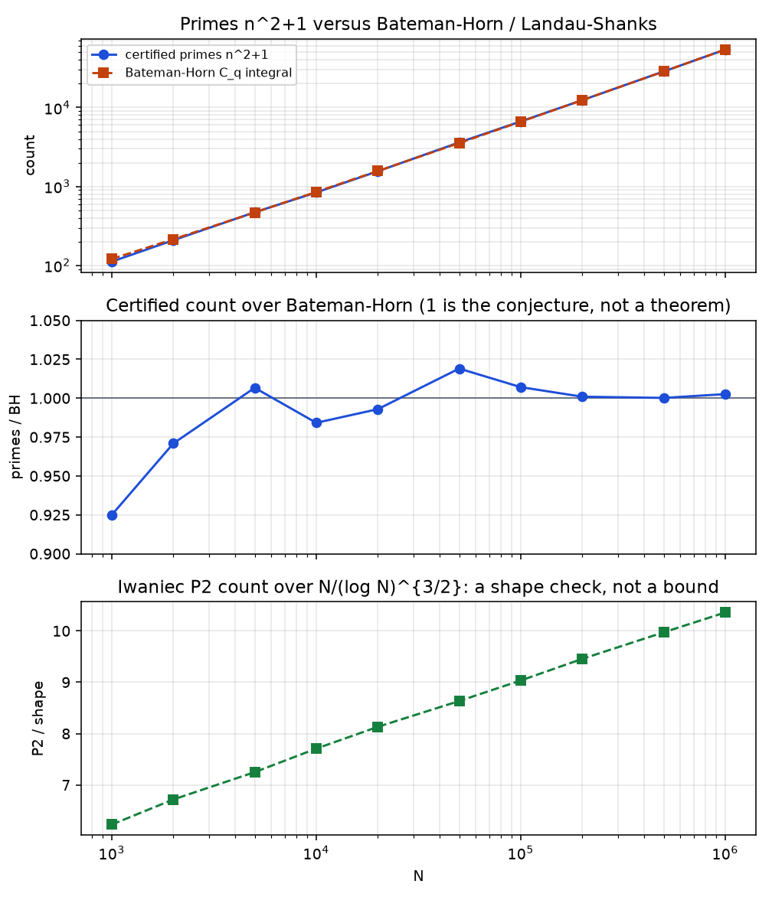

# Walkthrough — Landau 4, certified prefix and Iwaniec P2s

- Problem: `problems/landau-n2-plus-1`
- Date: 2026-08-17
- Argument status: independently replayable finite computation
- Problem status: open; infinitude of primes $n^2+1$ is not claimed

## 0. What was actually missing

Infinitude is the headline and is out of reach. What was missing on disk
was a prefix one can replay without trusting OEIS, together with the nearby
object Iwaniec actually proved — $n^2+1$ with at most two prime factors,
counted with multiplicity — and a comparison of the prime count to the
Landau–Shanks / Bateman–Horn main term.

A new prime not on the published list we cite would have been a construction.
That list is complete through $m^2+1<6.25\times 10^{28}$. We did not beat it.

## 1. False starts

Hilbert 16 / Smale 13 and Smale 7 were the other computational reads. Both
need a heavier pipeline than a primality sieve. Landau 3 is already checked
through $2^{64}$. See `notes/ideation-historical.md`.

The first sieve on this folder had three specific defects.

- It skipped $n=1$, so the prime 2 was missing until the verifier
  complained. That is the point of a verifier.
- `sqrt_minus_one` used $a^{(q+1)/4}$ for $a=-1$. That formula is for
  primes $\equiv 3\pmod 4$. Every $q\equiv 1\pmod 4$ fell through to a
  linear search. Harmless at the $N=200000$ cap, unusable for a complete
  factor sieve.
- `trial_omega` counted distinct prime factors $\omega$. Iwaniec's $P_2$
  is $\Omega\le 2$. The stored count 34507 at $N=200000$ was never written
  as a list, and it was the wrong predicate.

## 2. The useful failure

The $\omega$ mistake has a one-line witness:

$$
18^2+1=325=5^2\cdot 13,\qquad \omega(325)=2,\qquad \Omega(325)=3.
$$

So 18 is not an Iwaniec $P_2$. Replaying the first sieve's predicate at
$N=200000$ reproduced the 34507 exactly; the $\Omega=2$ count on the same
range is 31953. The 2554-term gap is the $325$ class. A failed or
mislabelled search with a verifier is the product. The 34507 was not a bound
and is not one now.

The leftover analysis is what the dead end taught. Trial division of every
$n^2+1$ up to $\sqrt{n^2+1}\approx n$ is $O(N^2/\log N)$ and dies at
$N=10^6$. The right remainder is not “try harder trial division”. It is
that after every prime $q\equiv 1\pmod 4$ with $q\le N$ has been divided
out, a leftover larger than 1 has all prime factors $>N$, and
$n^2+1\le N^2+1<N^3$ cannot be a product of three such primes.

## 3. The click

Only even $n$, and $n=1$, can make $n^2+1$ prime. For each prime
$q\equiv 1\pmod 4$ there is a square root of $-1\bmod q$, and $q$
divides $n^2+1$ exactly on the two progressions $n\equiv\pm r\pmod q$.
Sieving those progressions, and dividing out full powers, classifies
$\Omega(n^2+1)$ for every even $n\le N$. Leftover composites are split
by Pollard rho only to write the two prime factors down.

That is a finite classification, not a proof that the $\Omega=1$ column
is unbounded.

## 4. The argument, in the order it was found

### Local constraints

Odd $n>1$ make $n^2+1$ even and greater than 2. A prime divisor of
$n^2+1$ is 2 or $\equiv 1\pmod 4$. The equation $n^2+1=p^2$ is the
Pell equation $p^2-n^2=1$ and has no solution for $n\ge 1$. Therefore
an Iwaniec $P_2$ is either prime or a product of two distinct primes.

### Complete classification by a residue sieve

Write $r$ for a square root of $-1$ modulo $q=1\pmod 4$. After
removing every such $q\le N$ from $n^2+1$, the leftover $L$ satisfies:

- $L=1$: fully factored by small primes;
- $L$ prime: one more prime factor, possibly $L=n^2+1$ itself;
- $L$ composite: both prime factors exceed $N$, so $L=n^2+1$ and
  $\Omega(L)=2$.

Miller–Rabin on $L$, with a deterministic 64-bit witness set, separates
the last two cases. Pollard rho is used only when $L$ is composite, to
name the two factors.

### What is compared, and what is not claimed

Hardy–Littlewood / Bateman–Horn / Landau–Shanks predict

$$
\#\{n\le N:n^2+1\text{ prime}\}
\sim C_q\int_2^N\frac{dt}{\log(t^2+1)},
$$

with $C_q=1.372813462818246\ldots$ (OEIS A199401; Wolf's $C_q$). A match
is a check of the implementation against a conjecture, not a proof of the
conjecture and not a proof of infinitude.

Iwaniec's theorem supplies the comparison shape $N/(\log N)^{3/2}$ for
the $P_2$ count. The ratio of our $P_2$ count to that shape is a
descriptive diagnostic. It is not a new lower bound.

### The published record we did not beat

Wolf, arXiv:0803.1456, tabulated $\pi_q(10^k)$ through $k=20$.
OEIS A083844 continues that column through $k=28$. Grantham–Graves,
arXiv:2502.03513, computed every prime $m^2+1\le 6.25\times 10^{28}$.
A construction tonight would have been a prime with $n$ beyond that
range. We stayed at $N=10^6$ and matched Wolf through $10^{12}$
instead.

## 5. Computer residue

Replay from the problem folder:

```bash
python3 compute/sieve_n2p1.py --self-test
python3 compute/sieve_n2p1.py --n-max 1000000
python3 compute/verify.py
python3 compute/plot_counts.py
```

The sieve writes `compute/prime_n.txt` (54110 values of $n$) and
`compute/p2_omega2.txt` (147612 rows `n p q` with $n^2+1=pq$).
`compute/n2p1.json` holds the counts, the Wolf rows, the Bateman–Horn
integral, and SHA-256 of the two lists. The verifier ignores the stored
prime list, re-tests every even $n$ and $n=1$ by Miller–Rabin, multiplies
every claimed $P_2$ factorization back, and factors every even $n^2+1$
by an independent trial-plus-Pollard pass.

At $N=10^6$:

| object | count |
| ---: | ---: |
| $n$ with $n^2+1$ prime | 54110 |
| $\Omega(n^2+1)=2$ | 147612 |
| Iwaniec $P_2$ (union) | 201722 |
| $\omega\le 2$ composites (wrong predicate) | 158367 |

The $\Omega$ histogram on the 500001 live $n$ is a partition:
$1{:}54110$, $2{:}147612$, $3{:}161065$, $4{:}94019$, $5{:}33209$,
$6{:}8151$, $7{:}1541$, $8{:}242$, $9{:}44$, $10{:}8$.

Wolf / A083844, recomputed from our list as
$\#\{n:n^2+1<10^k\}$:

| $10^k$ | ours | Wolf |
| ---: | ---: | ---: |
| $10^6$ | 112 | 112 |
| $10^7$ | 316 | 316 |
| $10^8$ | 841 | 841 |
| $10^9$ | 2378 | 2378 |
| $10^{10}$ | 6656 | 6656 |
| $10^{11}$ | 18822 | 18822 |
| $10^{12}$ | 54110 | 54110 |

The first 10000 terms of `prime_n.txt` are the OEIS A005574 b-file; the
10000th $n$ is 158704. First primes
$2,5,17,37,101,197,257,401,577,677$ match A002496. First Iwaniec
composites: $8^2+1=5\cdot 13$, $12^2+1=5\cdot 29$. The integer 18 is
absent from `p2_omega2.txt`.

Bateman–Horn at selected $N$, from `compute/comparison.json`:

| $N$ | primes | $C_q\int$ | ratio |
| ---: | ---: | ---: | ---: |
| $10^3$ | 112 | 121.09 | 0.9249 |
| $10^4$ | 841 | 854.54 | 0.9842 |
| $10^5$ | 6656 | 6609.15 | 1.0071 |
| $2\cdot 10^5$ | 12391 | 12379.26 | 1.0009 |
| $5\cdot 10^5$ | 28563 | 28558.07 | 1.0002 |
| $10^6$ | 54110 | 53969.85 | 1.0026 |

The Wolf-li form at $N=10^6$ is 53970.55. OEIS A331942 predicts 53970.
A truncated Euler product for $C_q$ through $2\cdot 10^6$ recovers
1.37281051 against the published 1.37281346.



SHA-256 of the committed lists (also in `n2p1.json`):

- `prime_n.txt`: `89b7f94046012758cbc48f0b1b4511efb2e864cae0a46b29ea7210317aa3bc32`
- `p2_omega2.txt`: `9f3183d98bc58f09d5e48bf567f46fd6b39eb7cd710d4e81ca428aaf3cb49115`

## 6. Proven vs still open

Proven here, as a finite computation: there are exactly 54110 integers
$n$ with $1\le n\le 10^6$ and $n^2+1$ prime, and exactly 147612
further $n$ in that range with $\Omega(n^2+1)=2$. Both lists sit on
disk and are re-derived by `verify.py`. The prime count equals Wolf's
$\pi_q(10^{12})$. The count tracks the Bateman–Horn main term to a few
parts per thousand. None of that is a lower bound on the number of such
primes for all $N$, and none of it is infinitude.

Still open: Landau 4.

Not claimed: a new prime off the Wolf / Grantham lists; an improvement of
Iwaniec's exponent; anything about 2026 preprints.
