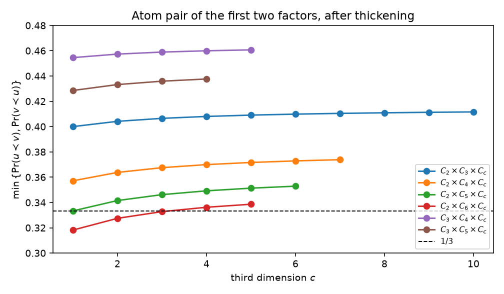
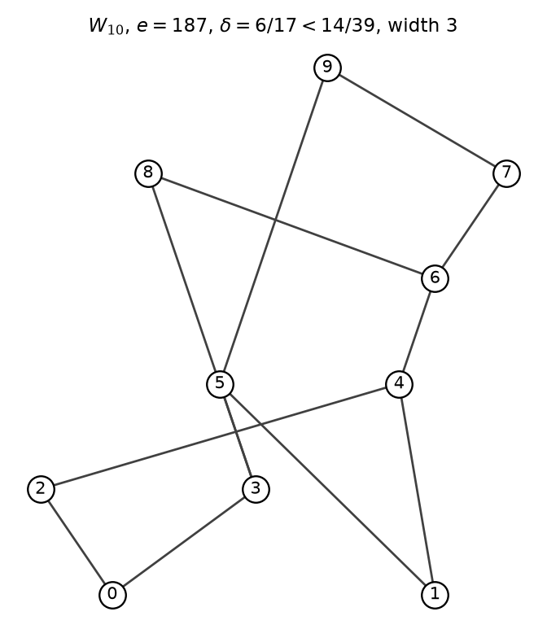

# Walkthrough — 1/3–2/3 conjecture, 2026-08-17

## 0. What was actually missing

The conjecture is not missing a definition. It is missing a *handle*: a class or a finite order that the 2018–2026 record still treats as open, and that an exact linear-extension counter can finish.

Gupta (arXiv:2607.23926, July 2026) already took the unrestricted finite order through 14, via Gold Partition. Order 15 is $10^{13}$ unlabelled posets. The first unpublished *width-3* order is 10: Trotter–Gehrlein–Fishburn and Olson–Sagan stop the $14/39$ census at nine elements. Independently, Olson–Sagan Question 3.9 still asks whether every product of three or more chains is $1/3$-balanced. Rectangles are known; $C_2\times C_2\times C_n$ is an automorphism. The first open boxes are $C_2\times C_3\times C_n$ and $C_2\times C_6\times C_3$.

The missing degree of freedom was which pair to test in a box, and that the width-3 $14/39$ record had one unused integer of order.

## 1. Named false starts

**Treat n=15 as tonight's finite order.** Gupta's 14-element Gold Partition run took 1594 core-hours on the unlabelled stream. Not a handle.

**3-dimensional hook-length.** $e(C_2^3)=48$, but $\prod h_{ijk}$ with the naive 3-ray hook is $8!/864\notin\mathbb Z$. There is no product formula to imitate Olson–Sagan's 2-dimensional argument.

**Almost-twins in every box.** Zaguia's theorem would finish Question 3.9 in one line. $C_2\times C_2\times C_n$ has them. An exhaustive search of $C_2\times C_3\times C_3$ finds *zero* almost-twin pairs. The class is not almost-twin.

**Use an arbitrary 2-face's atoms.** In the long rectangle $C_2\times C_6$ the Olson pair already has $\min=7/22<1/3$. Thickening by 3 leaves it at $0.332759<1/3$. For a moment this looks like a counterexample to Question 3.9.

**Treat Olson–Sagan Fig. 13 C as a 9-element 5+4 ladder.** A Ferrers search of all $5+4$ width-2 posets found no $\delta=37/106$. The fraction is Chen's $E(4,4)/E(5,5)$. Chen $P(5,5)$ has 10 elements, $e=106$, and $\delta=37/106$.

**Interval orders / 7-thin / unicyclic cover graphs.** Real open classes, no one-night certificate.

## 2. The useful failure

The $C_2\times C_6$ atom pair is the wrong pair, not a counterexample. In $C_2\times C_6\times C_3$ the two *largest* dimensions are 6 and 3, both $\ge 3$. Their 2-dimensional atom pair already lies in $[1/3,2/3]$ by the Olson–Sagan hook-length formula, and after embedding in the box the exact min is $0.417759$. A full all-pairs run on the 288 incomparable pairs gives

$$
\delta(C_2\times C_6\times C_3)=\frac{273419876590786707}{569177957111013830}\approx 0.480377.
$$

The failure of “use the atoms of any face” is what makes the case split: always take the two largest factors.

The red $C_2\times C_6\times C_c$ curve is the useful failure. It starts below $1/3$ and is the reason that face is never the one we thicken. Every curve that starts at or above $1/3$ stays there.

## 3. The click

Two largest dimensions of a non-chain box are both at least 3, or the box is already known.

Write $a\le b\le c$. If $a=1$, the poset is a rectangle. If two sizes are equal and at least 2, a coordinate swap is a 2-cycle automorphism and Olson–Sagan Prop. 2.3 gives $\delta=1/2$. In every remaining case $b,c\ge 3$, so the 2-face $C_b\times C_c$ has its Olson atom pair in $[1/3,2/3]$. Embed those two atoms and thicken by $a$.

On every box we could compute, that thickening *raises* $\min(p,1-p)$ toward $1/2$. If that monotonicity is true in general, Question 3.9 is settled for three factors. We do not claim the monotonicity beyond the computed range.

The second click is the width-3 census. Naturally labelled generation (add a maximal element on an ideal; keep the complement of width $\le 2$) hits every unlabelled class. Order 9 independently recovers Olson–Sagan. Order 10 is the first unpublished width-3 order, and it is not a confirmation: it produces a unique unlabelled example $W_{10}$ with $\delta=6/17<14/39$.

## 4. The argument, in the order it was found

Exact counters first. Order-ideal DP and remaining-set recursion agree; De Loof forward–backward agrees with “add the relation and recount”. Replay of $T$, Aigner sums, Chen's $E(m,n)$ table, Chen $P(5,5)=37/106$, hook-length rectangles, and $e(Y(4,4,2))=252$.

Exhaustive naturally labelled search at $n=7$ recovers Saks $M_7$: down-sets `[0,0,1,1,7,7,31]`, $e=39$, pair $25:14$, width 3, $\delta=14/39$. Both counters.

Plane-partition DP for boxes, checked against the bitmask counters through $n=24$. Atom-pair table for all $a\le b$, $abc\le 60$, and $C_2\times C_3\times C_n$ through $n=10$. All-pairs $\delta$ for the dangerous boxes $C_2\times C_k\times C_3$ ($k=3,\dots,7$), $C_2\times C_6\times C_4$, $C_3\times C_4\times C_3$: every one has $\delta\ge 0.467$.

Width-3 census in C (`compute/census.c`), independently replayed through $n=8$ in Python. Counts:

| n | naturally labelled | width 3 | min $\delta$ | below $14/39$ |
| ---: | ---: | ---: | ---: | ---: |
| 7 | 43502 | 40916 | $14/39$ | 0 |
| 8 | 657363 | 643236 | $14/39$ | 0 |
| 9 | 11106683 | 11026537 | $14/39$ | 0 |
| 10 | 204767041 | 204298353 | $6/17$ | 187 |

n=8 and n=9 minima are linear sums of $M_7$ with a chain. At n=10 the 187 labellings below $14/39$ equal $e(W_{10})$, so $W_{10}$ is the unique unlabelled width-3 10-element poset beating Saks.

## 5. Computer search

- `compute/records.json`: independently double-counted $T$, $M_7$, Chen $P(5,5)$, rectangles, $Y(4,4,2)$, small boxes.
- `compute/census.c` / `census`: C enumerator. Replay: `gcc -O3 -o census census.c && ./census 9`.
- `compute/width3_census.json`: the table above.
- `compute/certs/W10.json` and `compute/verify_W10.py`: the n=10 witness, four-way LE check.
- `figures/W10.png`: Hasse diagram.
- `compute/box_delta.json`: full $\delta$ for the dangerous boxes.
- `compute/thickening.json` and `figures/thickening.png`: the atom-pair curves.
- `compute/known.json`: first-pass M7 / Chen hunt.

## 6. What is proved vs still open

**Proved tonight, replayable.**

- Saks $M_7$ has $e=39$ and $\delta=14/39$, width 3. Two counters.
- Chen $P(5,5)$ has $\delta=37/106$. Two counters.
- Every naturally labelled width-3 poset on at most 9 elements has $\delta\ge 14/39$. Independent of Olson–Sagan. None of these orders has a width-3 poset with $\delta<1/3$.
- There is a unique unlabelled 10-element width-3 poset $W_{10}$ with $\delta=6/17<14/39$. Four LE counts give $e=187$; two pair counters give the split $121:66$; width is 3. This beats the published width-3 record. It is not below $1/3$, and it is not a width-2 record.
- Every product of three chains on at most 24 elements (bitmask), and every box in the plane-partition table (including $C_2\times C_6\times C_3$, $C_2\times C_7\times C_3$, $C_2\times C_3\times C_{10}$), has $\delta\ge 1/3$. For the computed range, the atoms of the two largest factors are already a $1/3$-balanced pair whenever both factors are at least 3.

**Still open.** The unrestricted conjecture. Gold Partition past 14. Width-3 past 10. Monotonicity of the box atom-pair in the third dimension, which would finish Olson–Sagan Question 3.9 for three factors. Dimension 2. Interval orders that are not semiorders. 7-thin. Whether any poset other than Aigner's linear sums of $T$ has $\delta$ exactly $1/3$.

# 2026-08-27

## 0. What was actually missing

The 17 August note treated Gupta as Gold Partition only. Version 2, posted 30 July, is a full $\delta$-census through 14. The missing handle after that census is not another 14-element poset. It is a named class past the published ladder table, or a width-3 example at $n\ge 15$ with $\delta<6/17$. Gupta's tail already says the second does not exist at $n\le 14$: the $6/17$ width-3 row is 29 ordinal sums, and every smaller tail value is width 2.

## 1. Named false starts

**Search for a width-3 poset with $\delta<6/17$ at $n\le 14$.** Incompatible with the published tail. One-point extensions of $W_{10}$ were still run, as a check: 101 width-$\le 3$ extensions, none below $6/17$.

**Grow $W_{10}$ while keeping $\delta\le 6/17$ and staying a non-sum.** The only $n=11$ extensions that keep $6/17$ are the two ordinal sums. The frontier is empty. That is the useful negative: $W_{10}$ does not start a width-3 family that stays at $6/17$ without padding.

**A three-rail analogue at $n=15$, exhaustive.** $2^{21}$ optional $+4$ and $+5$ rungs is a residue budget. The complete pass stops at $n=12$. A greedy $n=15$ walk stays above $6/17$.

**Interval orders through $n=10$.** Naturally labelled generation at $n=8$ is already $4.9\times 10^5$ posets. $n=10$ was killed as too slow for the same enumerator.

## 2. The useful failure

The $W_{10}$ extensions fail in the direction that confirms Gupta, not in the direction that produces a smaller width-3 $\delta$. Once that is checked, the unused published table is Peczarski's ladders, not another 10-element Hasse diagram.

## 3. The click

Peczarski's definition is two rails and a list of deleted rungs. Gupta recomputed the class through 14 to prove it matches the global non-sum minimum. The same enumerator, with this notebook's counters, continues past 14. That is a complete search of a named class, not a random sample.

## 4. The argument, in the order it was found

Replay Gupta's encodings first: $L_{14,1,9}$ is $254/725$, $e=725$; the $37/106$ witness is $e=318$; the width-3 $6/17$ encoding is an ordinal sum, $e=561$. Then the definition: rails $x_i<x_{i+2}$, rungs $x_i<x_{i+3}$. Every subset of the $n-3$ rungs, skip ordinal sums, take min $\delta$.

Through 14 the minima are Gupta's table. At 15 and 17 they are Peczarski's named broken sets, now with exact fractions $166/475$ and $1304/3737$. At 16, 18, 19, 20, 21 the minima are $665/1898$, $387/1108$, $458/1311$, $6059/17366$, $5402/15485$. The $n=21$ value is $\approx 0.348854$, just above the printed gap edge $0.348843$.

## 5. Computer search

- `compute/q1/verify_gupta.py` / `gupta_verify.json`
- `compute/q1/ladders.py` and `ladder_census.c`
- `compute/q1/ladder_census.json`: the table
- `figures/ladder_minima.png`
- `compute/q1/extend_w10.json`: 101 extensions, 0 below $6/17$
- `compute/q1/three_rail.json`, `interval_orders.json`

Replay: `cd compute/q1 && ./run_all.sh`.

## 6. What is proved vs still open

**Certified tonight.** Gupta v2 named witnesses. The broken-rung non-sum minimum at every order $7$ through $21$. No width-3 one-point extension of $W_{10}$ below $6/17$. No naturally labelled interval order on $\le 8$ elements below $1/3$.

**Still open.** The unrestricted conjecture. Width-3 $\delta<6/17$ at $n\ge 15$. Three-chain products. Dimension 2. Interval orders as a class. Gold Partition past 14. The $n=22$ ladder row.

# 2026-08-27, continued

## 0. What was actually missing

q1 named the leftover handles and then stopped. The $n=22$ ladder row was left running. Three-rail at $n=15$ was a greedy walk. Interval orders stopped at $n=8$ because the Python generator was slow. None of those is a new class: they are the same three classes, one integer further, if the enumerator can finish.

## 1. Named false starts

**Write the unfinished $n=22$ search as a minimum.** House rule. A partial mask sweep is residue.

**Look for a three-rail $\delta<6/17$ at $n\le 14$.** Gupta's tail already forbids a width-3 value there. The $n=13$ and $n=14$ passes were still run, as a check, and stayed above $6/17$.

**Treat $n=10$ interval orders as tonight's finite order before $n=9$ is certified.** A367494 says $197{,}409{,}097$ naturally labelled interval orders at $n=10$. $n=9$ is $9{,}062{,}503$ and is the first unpublished order of the class.

## 2. The useful failure

The q1 C ladder enumerator is correct and slow for a boring reason: every subset `memset`s $2^n$ words. At $n=22$ that is the whole budget. Once the ideals are stamped instead of zeroed, $2^{19}$ width-2 posets finish in seconds and the $n=22$ row is ordinary.

The $n=22$ minimum itself is a failure in the interesting direction: $\delta$ goes *up* from $5402/15485$ to $1065/3049$. The class does not march into the printed gap.

## 3. The click

The leftover handles were already finite subset searches. The missing degree of freedom was the memset.

## 4. The argument, in the order it was found

Replay the published record first (Gupta v2 still the order-14 census; Chan–Pak 13.1 still open; Question 3.9 still open). Then the stamp engine against q1: ladders $7$ through $21$, three-rail $8$ through $12$, interval $3$ through $8$. Then the unused integers.

$L_{22,1,5,6,9,12,13,17}$ has $e=54882$ and $\delta=1065/3049$. Python pair counters agree. $524{,}288$ non-sum ladders, none below $1/3$.

Three-rail through $15$: $2{,}097{,}152$ non-sums at $n=15$, minimum $30572/78185$, width $3$, above $6/17$. Winners replayed.

Interval orders through $9$: $9{,}062{,}503$ naturally labelled, matching A367494. Minimum $1/3$. Non-semiorder minimum $8/21$. The $n=9$ witnesses replay.

## 5. Computer search

- `compute/q2/ladder_census.c` / `ladder_census.json`
- `compute/q2/three_rail_census.c` / `three_rail.json`
- `compute/q2/interval_census.c` / `interval_orders.json`
- `figures/q2_class_minima.png`

Replay: `cd compute/q2 && ./run_all.sh`.

## 6. What is proved vs still open

**Certified tonight.** The broken-rung non-sum minimum at $n=22$. Every three-rail poset on $\le 15$ elements has $\delta>6/17$. Every naturally labelled interval order on $\le 9$ elements has $\delta\ge 1/3$.

**Still open.** The unrestricted conjecture. Width-3 $\delta<6/17$ outside the three-rail class at $n\ge 15$. Three-chain products. Dimension 2. Interval orders as a class past $n=9$. Gold Partition past 14. No $\delta<1/3$.
