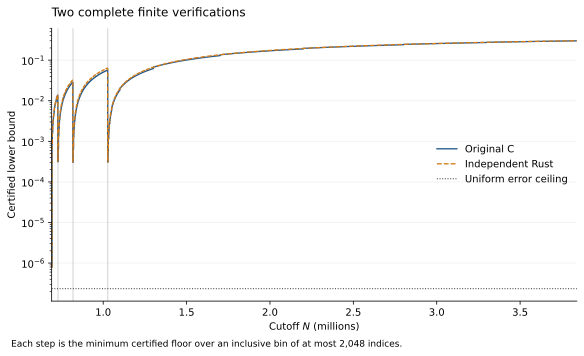

# Independent verification of an upper bound for the de Bruijn–Newman constant

Stephen Wu. Computational implementation and analytic audit: GPT-6 Astra,
2026-09-08. Computer-assisted verification; no external peer review claimed.

The certificate establishes

$$
\Lambda\leq\frac{893927}{5000000}=0.1787854<\frac15.
$$

The number and the candidate argument are due to Jude Gomila. They were
available in an [unpublished repository](https://github.com/judegomila/dbn-lambda-01787854-candidate-audit/tree/a74738deb6d5e0f76887cb36901da08b68dca705)
before this work. The comparison is with the published $1/5$ bound of
Platt and Trudgian, not with a newly chosen decimal target. The reduction
from that endpoint is $106073/5000000=0.0212146$, or $10.6073\%$.

The contribution here is an independent finite verification algorithm and
a complete reproduction of the candidate's numerical obligations. The
finite algorithm interpolates positive Dirichlet sums as their integer
cutoff changes. It checks all 3,149,013 required indices in about ten minutes
on one core, using about 11 MiB including its Python launcher. A replay of
the original producer takes about 71 minutes on this machine. This is a
comparison of the two specified run configurations, not a general speed
claim. Both give the same global lower floor, with a positive margin of
more than $5.5787\cdot10^{-7}$ after approximation error.

The analytic audit checks the normalization, transfers between horizontal
windows and heights, the infinite tail, and the closed time endpoint at
zero. It does not constitute external peer review. The calculation uses
the published zero-height theorem as an input; it does not repeat the
original computation of zeta zeros.

## 1. The published criterion

Write $H_t$ for the heat deformation in Polymath 15, normalized as in that
paper. Its zeros are all real precisely when $t\geq\Lambda$. The lower
bound $\Lambda\geq0$ is known, and RH would say $\Lambda=0$.

Theorem 1.2 of [Polymath 15](https://arxiv.org/abs/1904.12438v2) gives
$\Lambda\leq t_0+y_0^2/2$ from three statements:

1. Zeta has no zero in $(1+y_0)/2\leq\Re s\leq1$, $0\leq\Im s\leq X/2$.
2. $H_{t_0}(x+iy)\ne0$ for $x\geq X+\sqrt{1-y_0^2}$ and
   $y_0\leq y\leq\sqrt{1-2t_0}$.
3. $H_t(x+iy)\ne0$ when $0\leq t\leq t_0$,
   $X\leq x\leq X+\sqrt{1-y_0^2}$, and
   $\sqrt{y_0^2+2(t_0-t)}\leq y\leq\sqrt{1-2t}$.

We use the exact parameters

$$
X=6000000185827,\qquad t_0=\frac{129}{800},\qquad
y_0=\sqrt{\frac{87677}{2500000}}.
$$

[Platt–Trudgian, Theorem 1](https://arxiv.org/abs/2004.09765v1) verifies
RH through height $3000175332800$. Its excess over $X/2$ is exactly
$350479773/2>0$, establishing the first input. The same paper's Corollary 2
is the published bound $\Lambda\leq1/5$ used for comparison.

Theorem 1.3 of Polymath 15 supplies a nonvanishing normalizer $B_t(z)$ and
an explicit finite sum $f_t(z)$ satisfying

$$
\left|\frac{H_t(z)}{B_t(z)}-f_t(z)\right|
\leq e_A+e_B+e_{C,0}.
$$

All numerical regions below have $x>200$ and $0\leq y\leq1$.
For the last error term we use the conservative constant
$3.58+6.92=10.50$ obtained directly from Proposition 6.6(vi). The proof
replaces $x-8.52$ by the smaller positive denominator $x-12$, then applies
$1+u\leq e^u$. Thus the certificate does not depend on recovering the
smaller displayed constant in equation (24).

## 2. A finite functional in the theorem's normalization

Set $t=t_0$, $q_N=N^2-t/16$, and $x_N=4\pi q_N$. The index of the
approximation is $N$ on $x_N\leq x<x_{N+1}$. On this window use

$$
g_N(y)=e^{y/50}q_N^{-y/2},\qquad
k_N(y)=\frac{ty}{2(x_N-6)},
$$

$$
\sigma_N(y)=\frac{1+y}{2}+\frac t4\log q_N
-\frac{t}{2x_N^2}
\max\left(0,1-3y+\frac{4y(1+y)}{x_N^2}\right).
$$

These bound $|\gamma|$, $|\kappa|$, and $\Re s_*$ in the directions
$|\gamma|\leq g_N$, $|\kappa|\leq k_N$, and $\Re s_*\geq\sigma_N$.
The directions remain conservative throughout the window: the two absolute
bounds decrease with $x$, while the real-part minorant increases. For the
clipped term, its nonnegative numerator and its factor $x^{-2}$ both
decrease, including across the point at which the numerator becomes zero.

Let $\mathcal P$ be a finite set of primes, $D=\prod_{p\in\mathcal P}p$,
and

$$
b_t(m)=e^{(t/4)\log^2m},\qquad
\lambda_d=(-1)^{\omega(d)}\prod_{p\mid d}b_t(p)\quad(d\mid D).
$$

The product of individual prime weights is essential here. Define

$$
B_{N,n}=\sum_{\substack{d\mid D,\ d\mid n\\n/d\leq N}}
\lambda_d b_t(n/d),\qquad
A_{N,n}(y)=\sum_{\substack{d\mid D,\ d\mid n\\n/d\leq N}}
\lambda_d b_t(n/d)(n/d)^y.
$$

Let

$$
M_N(y)=\sum_{d\mid D}|\lambda_d|d^{-\sigma_N(y)},\qquad
C_N(y)=\sum_{m=2}^N b_t(m)(m^{k_N(y)}-1)m^{y-\sigma_N(y)}.
$$

The quantity checked by the finite calculation is

$$
L_N(y)=\frac{1-g_N(y)-\sum_{n=2}^{DN}
(|B_{N,n}|+g_N(y)|A_{N,n}(y)|)n^{-\sigma_N(y)}}{M_N(y)}
-g_N(y)C_N(y).
$$

**Lemma.** If $L_N(y)>0$, then $|f_t(x+iy)|\geq L_N(y)$ on the
whole $N$-window.

**Proof.** Multiply the first Dirichlet sum in $f_t$ by
$E(s_*)=\sum_{d\mid D}\lambda_d d^{-s_*}$, and the conjugated second
sum by $\overline{E(s_*)}$. Dirichlet convolution gives the coefficients
$B_{N,n}$ and $A_{N,n}$ above, with constant coefficients both equal to
one. Bounding the nonconstant coefficients absolutely gives

$$
|E|\,|f_t|\geq Q_N-|E|g_NC_N,
$$

where $Q_N$ is the numerator in $L_N$. The correction follows from
$|e^{-\kappa\log m}-1|\leq m^{k_N}-1$. Since $M_N>0$ and $g_NC_N\geq0$,
positivity of $L_N$ implies $Q_N>0$. The displayed inequality then excludes
$E=0$. Dividing by $|E|$ and using $|E|\leq M_N$ proves the assertion.
The positivity of $Q_N$ justifies the direction of the last division.

## 3. Two complete finite calculations

Both implementations cover this exact schedule:

| Prime set | Integer indices, inclusive | Rows |
| --- | ---: | ---: |
| $2,3,5,7,11$ | $690988\ldots728999$ | 38012 |
| $2,3,5,7$ | $729000\ldots818999$ | 90000 |
| $2,3,5$ | $819000\ldots1027999$ | 209000 |
| $2,3$ | $1028000\ldots3840000$ | 2812001 |

The first is the pinned C producer, freshly rebuilt and run in 23
sequential segments. Every generated row agrees with the candidate's
archived row. The second is a new Rust implementation. It reads no
candidate row, moment, or frozen gamma weight.

For fixed $N$ and $y=y_0$, the Rust calculation maintains the positive sums

$$
S_B(s)=\sum_{n=2}^{DN}|B_{N,n}|n^{-s},\quad
S_A(s)=\sum_{n=2}^{DN}|A_{N,n}(y_0)|n^{-s},\quad
U(s)=\sum_{n=2}^{N}b_t(n)n^{y_0}\log n\,n^{-s}
$$

at eight cosine nodes in the interval of possible $\sigma_N(y_0)$.
If $S(s)=\sum c_n n^{-s}$ has $c_n\geq0$ and support at most $DN$,
write $a$ for the left endpoint and $s_0$ for the first node. With
$\ell=\log(DN)$ and eight-node interpolant $P$, the remainder obeys

$$
|S(s)-P(s)|\leq
\frac{\ell^8 e^{(s_0-a)\ell}S(s_0)}{8!}
\left|\prod_{j=0}^7(s-s_j)\right|.
$$

Indeed, $|S^{(8)}(u)|\leq\ell^8S(a)$ and
$S(a)\leq e^{(s_0-a)\ell}S(s_0)$. The ordinary real interpolation
remainder gives the result. Arb encloses the nodes, sums, argument,
Lagrange weights, and remainder; the full upper bound is added as an
error radius.

The initial convolution merges the streams $d,2d,\ldots,dN$ and collects
all pairs with the same product before taking an absolute value. On
increasing $N-1$ to $N$, only the indices $dN$ change. At each such
index the code reconstructs the old coefficient, adds the new pair
$(d,N)$, and adds the difference of absolute coefficients to each node
sum. This telescopes exactly. Signed update differences do not compromise
the nonnegativity of the coefficients in the resulting sum.

The correction is bounded independently using

$$
e^{k_N\log m}-1\leq k_N\log m\,e^{k_N\log N}.
$$

The complete remainder and update argument is in
[`INTERPOLATION.md`](INTERPOLATION.md). A separate Rust direct convolution
checks the weakest row without interpolation. A Python dictionary
convolution checks 100 small cases, including changes of the active divisor
set and coefficient signs.

Both full calculations give

$$
L_N(y_0)\geq\frac{791366}{10^{12}}
\qquad(690988\leq N\leq3840000),
$$

with the minimum floor at $N=690988$. The two implementations share
FLINT/Arb. They are independent algorithms and source implementations,
not independent transcendental libraries.

Each step is the minimum integer floor over an inclusive bin of at most
2,048 indices. The vertical lines mark changes of Euler prime set. The
dotted line is the uniform approximation error ceiling. The exact bin
data and an exportable PDF are in `figures/`.

## 4. Passing from the sampled height to a region

The height step concerns a finite sum of absolute values. It cannot be
justified by assuming that its signed coefficients never vanish.
Put $g=g_N'/g_N=1/50-(\log q_N)/2<0$ and $\ell=\log n$.
The clipped minorant has lower right slope at least $1/2$. For each
coefficient, including a zero of $A=A_{N,n}$,

$$
D^+\big[(|B|+g_N|A|)n^{-\sigma_N}\big]
\leq n^{-\sigma_N}
\left[g_N|A'|+g_Ng|A|-\frac\ell2(|B|+g_N|A|)\right].
$$

This follows from $D^+|A|=|A'|$ at a zero and
$(|A|)'=\operatorname{sgn}(A)A'$ elsewhere. After factoring out $b_t(n)$,
the candidate reduces the bracket to a finite divisor-pattern inequality.
For a gcd mask, the active divisors are a suffix of its ordered divisors;
there are $3^k$ nonempty patterns for $k$ primes. Empty active sets
contribute zero.

The fresh Arb checks at 180 and 256 bits cover respectively 243, 81, 27,
and 9 patterns over the four full index ranges and the closed height
interval $[y_0,\sqrt{271/400}]$. Every positive-part ratio is strictly
less than one; the largest printed upper bound is
$0.99999860767275095$. The summands are locally Lipschitz, hence absolutely
continuous, so the nonpositive upper derivative gives nonincrease of the
mass. This implication and its endpoint reductions are reviewed in
[`ANALYTIC_REVIEW.md`](ANALYTIC_REVIEW.md).

The normalizer decreases as $\sigma_N$ increases. The logarithmic derivative
of each positive correction term is bounded by

$$
\frac1{50}-\frac12\log q_N+\frac12\log N
+\frac{t}{2(x_N-6)}\log N+\frac1{y_0}.
$$

Its maximum is less than $-1.36311215475764$. Thus the correction decreases.
The positive numerator increases, the positive denominator decreases, and
the subtracted correction decreases. Therefore $L_N(y)\geq L_N(y_0)$.

The fresh error calculation gives the uniform upper bound

$$
e_A+e_B+e_{C,0}<
\frac{233494905212337849}{10^{24}}.
$$

The finite region is consequently zero-free with margin at least

$$
\frac{557871094787662151}{10^{24}}>0.
$$

## 5. The infinite tail

The tail begins at $N_*=3840000$, overlapping the last finite window.
The candidate uses an eleven-term real mollifier and a head cutoff
$M=153814$. Its basic tail estimate is elementary: if
$\sigma>(t/2)\log c$, the summand $b_t(u)u^{-\sigma}$ decreases on
$[a,c]$, and after setting $v=\log u$ the integral is bounded by

$$
\operatorname{Cap}_t(a,c;\sigma)=
\max\{a b_t(a)a^{-\sigma},c b_t(c)c^{-\sigma}\}\log(c/a).
$$

The logarithm of the transformed integrand is convex, so the endpoint
maximum bounds it. Partitioning the convolution pairs according to
$dm\leq M$ and $dm>M$ gives an exhaustive head and remainder.
The candidate's additional overshoot term is nonnegative padding.

The all-$N$ extension checks the derivatives of both cap endpoints and
their logarithmic width. For a fixed left endpoint $a$, the sufficient
gates are

$$
\frac t2\log a\log(N/a)>1,\qquad
(\sigma-1)\log(N/a)>1.
$$

Once true at $N_*$ they persist as $N$ increases. The error caps use
their own head cutoff, 3000, and are checked separately. The full
height interval is handled by decreasing endpoint factors, and the
whole rational time interval is evaluated with interval arithmetic.

The source review checks these implications against the candidate's
[tail lemma](https://github.com/judegomila/dbn-lambda-01787854-candidate-audit/blob/a74738deb6d5e0f76887cb36901da08b68dca705/TAIL_LEMMA.md).
Fresh C/Arb calculations at 256 and 512 bits give contraction
$D<0.999721<1$ and final normalized margin greater than $0.00017352$.
A separately implemented Python interval calculation corroborates the
tail with a different arithmetic backend. Together with the finite
region this supplies the second criterion input.

## 6. The complete closed barrier

The third criterion region is contained in

$$
[X,X+1]+i[1809/10000,1],\qquad 0\leq t\leq129/800.
$$

The rectangle is wider and lower than the required curved barrier.
The Riemann–Siegel index is constantly 690988 on this entire closed box.
The candidate represents the finite sum using a $62\times62$ complex
coefficient matrix. All 7,688 real components are regenerated, enclosed
by Arb balls, and checked to fit the coefficient balls consumed by the
barrier code. A separate factorial bound verifies the Taylor remainder
below $10^{-20}$. The quadrature used to choose a matrix size is not a
proof input: validity of the chosen size comes from this latter bound.

For each time prism, let $v$ be a lower bound for the sampled modulus,
$D_z$ and $D_t$ the derivative upper bounds, $h$ the spatial mesh spacing,
$\Delta t$ the time width, and $\epsilon=1/800$ the approximation allowance.
The decisive inequality is

$$
v-\frac{D_zh}{2}-D_t\Delta t-\epsilon>0.
$$

On each half of an edge, the true image and the endpoint chord lie in
the same convex disk about the nearer endpoint. Its radius is bounded
by the displayed allowances, so the homotopy avoids zero. The polygon's
winding integer is therefore that of $H_t/B_t$. The full winding ball
lies inside $(-1/4,1/4)$, forcing that integer to be zero. Since $B_t$
has no zeros or poles in the rectangle, the argument principle proves
nonvanishing inside as well as on the boundary.

The derivative bounds apply on complete closed prisms. The quadrature
callbacks preserve their complex arguments and provide holomorphic
enclosures; the discrete derivative sums use an exact head and a
decreasing integral tail. The replay requires all 883 consecutive prisms
to finish. An independent rational parser recomputes each inequality,
checks all seams, and checks both closed endpoints.

The fresh replay completed all 883 prisms. The smallest independently
recomputed margin exceeds $0.5198$, and all 7,688 regenerated coefficient
components fit their serialization balls. The uniform approximation error
is less than $0.000356523011600040<1/800$.

The positive-time restriction in the approximation theorem also needs
attention. On this fixed compact rectangle the integrand defining $H_t$
is dominated, for $0\leq t\leq t_0$, by
$e^{t_0u^2+u}|\Phi(u)|$, which is integrable by the super-exponential decay
of $\Phi$. Hence $H_t$ is continuous at zero. The normalizer and its
reciprocal are continuous and nonzero, and the constant integer index
makes $f_t$ a fixed finite sum. Passing to the limit in the uniform
positive-time error estimate proves the same estimate at zero. No
limit uniform over unbounded $x$ is needed.

## 7. Reproduction and scope

[`CLAIM.md`](CLAIM.md) is the authoritative status and exact inequality.
[`run_all.sh`](run_all.sh) checks the retained complete certificate with
one argument, a clean checkout of the pinned candidate. Supplying a new
output directory as a second argument rebuilds and reruns every numerical
lane sequentially. The certificate mode says explicitly that it checks
recorded interval computations. Neither mode accepts a successful prefix
of an incomplete finite range or time cover.

The original and Rust finite implementations share Arb. The error and
tail have C/Arb and Python interval checks. The barrier has a fresh
interval computation and an independent exact-rational interface check;
it does not have a second complete implementation of its derivative
enclosures. The analytic audit is source-level mathematical review by
the named model. These are the actual independence boundaries of this
computer-assisted argument.

All three criterion inputs are now certified. Exact substitution gives

$$
\Lambda\leq\frac{129}{800}+\frac12\frac{87677}{2500000}
=\frac{893927}{5000000}<\frac15.
$$

This finite improvement leaves RH open.
