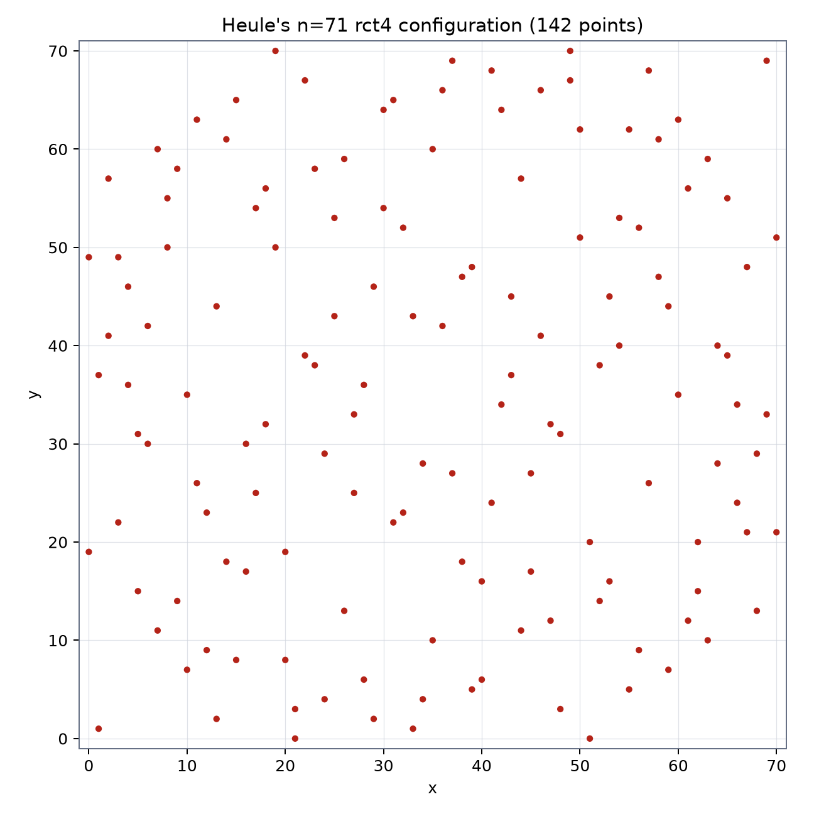

# No-three-in-line at n=75

- Slug: `three-in-line`
- Solver: Codex `gpt-5.6-sol` Max (2026-08-16 search; 2026-08-23 replay and $n=75$ campaign). Grok watched only.
- Status: $n=75$ is the first current hole; target $D(75)=150$
- Area: Discrete geometry
- Sources: Green 100 #72; Dudeney 1900 / Guy–Kelly 1968; Prellberg, arXiv:2602.07751; Heule 2026 (Flammenkamp database); MathWorld
- Started: 2026-08-16
- Campaign: find and independently replay a 150-point certificate on the $75\times 75$ grid

## In general

Place as many points as possible on the $n\times n$ grid
$\{0,\dots,n-1\}^2$ so that no three are collinear (any slope, not
just axis-aligned). Pigeonhole on rows gives $D(n)\le 2n$. The
no-three-in-line problem asks whether $D(n)=2n$ for every $n$, or
only for small $n$. Green #72 records both the finite question and
the asymptotic one (Guy–Kelly suggested $\sim(\pi/\sqrt{3})n\approx 1.81n$,
so $2n$ would eventually fail; Hall-type constructions still give
almost $2n$ for infinitely many $n$).

The finite record moved fast in 2026. Prellberg (arXiv:2602.07751)
used symmetry-reduced CP-SAT to get $D(n)=2n$ for all $n\le 60$.
Flammenkamp's dated database then recorded Prellberg configurations at
$n=61,62,63,64,66,68,74$ and Heule configurations at
$n=65,67,69,70,72,76$. On 17 August 2026 Heule found an rct4
configuration at $n=71$, followed by $n=73$ on 19 August. Thus $2n$ is
now known for every $n\le74$ and for $n=76$; the first current hole is
$n=75$.

The previous campaign recovered Heule's $n=71$ database code, decoded it to
142 coordinates, and checked it with two exact implementations. The present
campaign is scoped to the first remaining hole, $n=75$. Odd order cannot use
clean $C_4$ (`rot4`) orbits—the rotation centre is a lattice point—so the
first search uses Flammenkamp's **rct4**, with four-orbits off the diagonal
and half-turn pairs on it.

## Precise statement

A set $P\subseteq\{0,1,\dots,74\}^2$ is *no-three-in-line* if no
three distinct points of $P$ are collinear in $\mathbb{R}^2$:
equivalently, for all distinct $a,b,c\in P$,
$$
(b_x-a_x)(c_y-a_y)-(c_x-a_x)(b_y-a_y)\ne 0.
$$
**Finite target.** A checked set with $|P|=150$ would meet the row bound and
prove $D(75)=150$. No such certificate is currently known in the database cut
of 19 August 2026. An incomplete or symmetry-restricted SAT run is residue,
not evidence that $D(75)<150$.

A SAT/CP encoding has one Boolean per cell (or per rct4 orbit);
for every line that meets the grid in $k\ge 3$ points, at most
two of those points are selected. Cardinality is exactly 150 points.
In canonical rct4 this means one selected diagonal half-turn pair and
37 selected four-orbits, with the anti-diagonal fixed empty.

## What a solution looks like

- **Found and replayed.** A plain `compute/n75-150.txt` stores one `x y` pair
  per line. Two independent exact verifiers must check 150 distinct in-grid
  points, exactly two in every row and column, and no collinear triple.
- **Not found.** The CNF or CP model under `compute/`, the symmetry
  reduction, solver + version, wall-clock / timeout, and whether the
  result was timeout, unsat (on the restricted symmetry), or
  inconclusive. Unsat on rct4 is an incomplete search, not a proof that
  $D(75)<150$.
- Do not claim $D(75)=150$ without a checked point list. Do not
  claim $D(75)<150$ without a complete (not symmetry-restricted)
  unsat proof. Do not start an asymptotic campaign from this folder.

## Related

- [Ben Green, *100 Open Problems*, Problem 72](https://people.maths.ox.ac.uk/greenbj/papers/open-problems.pdf)
- [Guy–Kelly, *The no-three-in-line problem*, Canad. Math. Bull. 1968](https://doi.org/10.4153/CMB-1968-007-3)
- [Prellberg, *Constraint Satisfaction Programming for the No-three-in-line Problem*, arXiv:2602.07751](https://arxiv.org/abs/2602.07751)
- [Flammenkamp, no-three-in-line database (Heule 2026 entries)](http://wwwhomes.uni-bielefeld.de/achim/no3in/readme.html)
- [MathWorld, *No-Three-in-a-Line Problem*](https://mathworld.wolfram.com/No-Three-in-a-LineProblem.html)
- [formal-conjectures #1692, Green #72](https://github.com/google-deepmind/formal-conjectures/issues/1692)

## Campaigns so far

- The 16 August rct4 CP-SAT and SAT runs ended `UNKNOWN`; their generated CNF
  was not preserved in this checkout.
- On 23 August the current database certificate decoded and passed both exact
  verifiers, proving $D(71)=142$.
- On 23 August the live database notes and both unrestricted and rct4 lookups
  were refreshed. They contain no $n=75$ configuration at the 19 August cut;
  the $n=75$ search is in progress.

## Figures

