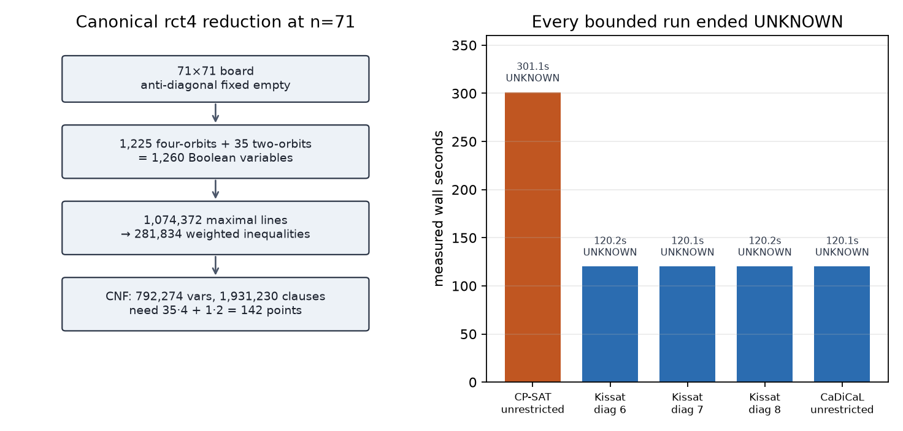

# How the n=71 rct4 search came together

> **Update, 23 August 2026.** The search history below is retained because it
> explains the exact rct4 model and its bounded failures. After that search,
> Heule found an $n=71$ certificate on 17 August. Section 7 records its
> recovery from the current database and independent replay.

## 0. What was actually missing

The missing object was not another statement of the no-three-in-line problem.
It was a correctly reduced, reproducible instance at the first unresolved
order. For odd $n$, “quarter-turn symmetry except on the long diagonals” is
not an ordinary group action, and a casual orbit quotient can encode the wrong
class. We needed the exact rct4 convention, a complete enumeration of every
relevant rational line, and a timeout mechanism whose `UNKNOWN` status meant
what its log said. Only after those three pieces agreed was it meaningful to
spend solver time at $n=71$.

## 1. Named false starts and their obstructions

The first tempting symmetry was honest quarter-turn invariance. It fails
before search: on an odd 71×71 board, every noncentral orbit has size four and
the centre has size one, so an invariant set has cardinality congruent to zero
or one modulo four, never $142\equiv2\pmod4$.

Our next interpretation allowed independent half-turn pairs on both long
diagonals and quarter-turn orbits elsewhere. That is a coherent 1,296-variable
class, but it is not the canonical odd-order model used in the computational
record. The published construction fixes the anti-diagonal empty, takes one
half-turn pair on the main diagonal, and uses quarter-turn orbits everywhere
else. The obstruction here was semantic, not computational: solving a nearby
symmetry class would not answer the requested rct4 search.

The first serious engine was CP-SAT. The model was exact, but a four-worker
run ended `UNKNOWN` after 301.1 seconds. This did not reveal a mathematical
contradiction; it exposed the heavy-tailed search barrier already visible in
Prellberg's experiments. A compact constraint model is not the same thing as
a quickly searchable one.

There was also a tooling false start. PySAT exposes an `interrupt` method, so
we initially scheduled a Python timer around Kissat. The wrapped C call held
the interpreter long enough that the timer did not enforce the advertised
cutoff. We discarded those untrustworthy timings, moved the solver into a
forked child, and let the parent terminate it at a measured wall-clock
deadline. A timeout log is a certificate only of what actually ran.

## 2. The useful failure

The smaller instances told us that the geometry was right even though the
target did not fall. At $n=9$, both CP-SAT and the CNF solver found the same
canonical-rct4 witness, and the independent checker exhausted all 816 triples.
At $n=57$, our quotient produced 812 orbit variables and roughly 118,000
constraints, matching the published model scale. These checks ruled out the
most dangerous failure mode: a fast but subtly incomplete line generator.

The CP-SAT timeout also left useful structure. Presolve recognized the one
remaining reflection, removed thousands of dominated inequalities, and still
retained all 1,260 decision variables. The no-LP search engine accumulated the
bulk of the conflicts without finding a first solution. That suggested
changing the proof engine to a dedicated SAT solver while preserving the
same mathematical instance. Finally, the published $n=65$ and $n=69$
witnesses place their exceptional diagonal pair at indices 6 or 7. This did
not justify fixing the $n=71$ pair, but it gave three sensible disjoint
subsearches—6, 7, and the adjacent index 8—alongside an unrestricted run.

## 3. The click

The decisive organizational change was to treat rct4 as a weighted quotient,
not as cell equalities added after the fact. A maximal grid line does not just
contain orbit variables; it can meet one orbit twice. Its exact constraint is

$$
  \sum_O |\ell\cap O|\,y_O\le2.
$$

Once every line was reduced to this incidence vector, identical constraints
could be deduplicated and both CP-SAT and CNF could be generated from the same
solver-independent geometry. The independent witness checker then stayed on
the other side of a clean boundary: it knows nothing about rct4, orbits,
maximal lines, or SAT auxiliaries; it only evaluates integer determinants.

## 4. The argument in the order it became inevitable

Write $71=2m+1$ with $m=35$, and let
$\rho(x,y)=(y,70-x)$. The canonical fundamental domain is

$$
  H=\{0,\ldots,35\}\times\{0,\ldots,34\}.
$$

For $(i,j)\in H$ with $i\ne j$, the variable represents the four cells in
its $\rho$-orbit. For $(i,i)$, it represents only
$(i,i)$ and $(70-i,70-i)$. Every anti-diagonal cell $(i,70-i)$, including
the centre, is fixed empty. This partitions the nonfixed cells into 1,225
four-orbits and 35 two-orbits, hence 1,260 Boolean variables. Exactly 35 of the
first kind and one of the second kind would select
$35\cdot4+1\cdot2=142$ points.

Every lattice line containing at least three grid cells has a unique primitive
step $(a,b)$, up to sign, with $\gcd(|a|,|b|)=1$. We enumerated each such
direction and started a line only where one backward step leaves the board.
This produces every maximal line once. Any collinear triple lies on one of
these lines, so imposing at most two selected cells on all of them is both
necessary and sufficient.

There were 1,074,372 maximal lines. Horizontal and vertical inequalities were
replaced by the stronger equalities saying that every row and column contains
exactly two points. On every other line we removed the fixed anti-diagonal
cells, counted orbit multiplicities, discarded inequalities whose maximum
possible left side was already at most two, and deduplicated equal incidence
vectors. The result was 281,834 distinct weighted line inequalities.

For CP-SAT, those inequalities can be stated directly. For CNF, all weights
are one or two. If $D$ is the set of coefficient-two variables and $S$ the
coefficient-one variables, the weighted bound is exactly the conjunction of

- at most one variable in $D$;
- no selected variable in $D$ together with one in $S$; and
- at most two variables in $S$.

Sequential counters encode the remaining cardinalities. This produced a
complete DIMACS instance with 792,274 variables including auxiliaries and
1,931,230 clauses. A separate streaming pass matched the header, read exactly
that many zero-terminated clauses, and saw maximum variable identifier
792,274.

The solve phase then had two branches. OR-Tools CP-SAT ran the direct weighted
model for 301.1 seconds on four workers. Kissat ran the fixed diagonal slices
6, 7, and 8, while CaDiCaL ran the unrestricted diagonal model. A parent
process imposed a hard 120-second wall limit on each SAT run. Every run ended
`UNKNOWN`, and none emitted a model.

## 5. Figures, checks, and computer search

The generators remain in [`compute/`](compute/), but the generated CP-SAT and
DIMACS files were not preserved in the current checkout. The old hashes and
bounded solver outcomes therefore document the run but do not by themselves
form a replay from this checkout:

| engine | diagonal pair | measured solve time | result |
| --- | ---: | ---: | --- |
| OR-Tools CP-SAT 9.15.6755, 4 workers | unrestricted | 301.1 s | `UNKNOWN` |
| Kissat 4.0.4 | 6 | 120.15 s | `UNKNOWN` |
| Kissat 4.0.4 | 7 | 120.13 s | `UNKNOWN` |
| Kissat 4.0.4 | 8 | 120.15 s | `UNKNOWN` |
| CaDiCaL 1.9.5 | unrestricted | 120.14 s | `UNKNOWN` |

The unrestricted CNF has SHA-256
`9a87227d743e9a2e956ac427940f601e5722f9773a6035cacedbe43d3f824bd5`;
the exported CP-SAT model has SHA-256
`e298d549ff035678b0aa6847d3b7b6672f873f2f90490517da95d19567223bda`.
The checker
[`compute/verify_n71.py`](compute/verify_n71.py) was ready to test all
$\binom{142}{3}=467{,}180$ determinants if a later solver produced the plain
coordinate file. No such file existed at the end of that campaign.

## 6. Proven, still open, and the scope check

At the end of the 16 August run, what had been established was the
canonical-rct4 generator and a precise timeout, incomplete. The line
enumeration was exhaustive, the symmetry quotient matched the published
odd-order convention, and the independent checker worked on a known smaller
case. The generated DIMACS structure had been audited during that run, but the
file itself did not survive in this checkout.

At that point, the existence of 142 no-three-in-line points at $n=71$ had not
been established. We had not found a witness or established nonexistence:
CP-SAT, Kissat, and CaDiCaL all timed out, so even the restricted
canonical-rct4 instance was undecided. The three fixed diagonal runs were not
UNSAT certificates for their slices, much less for the other 32 diagonal
positions.
An rct4 UNSAT result would still not have proved $D(71)<142$, because an
asymmetric configuration could exist. Nothing in this computation addressed
the asymptotic Guy–Kelly question. That was the exact status on 16 August; it
was superseded by the certificate replay below.

## 7. The certificate that arrived after the search

The missing object on 23 August was no longer a SAT model. Flammenkamp's
current dated notes said that Marijn Heule had found the first $n=71$ solution
on 17 August, in the same rct4 class. The database lookup for symmetry `c`,
size 71, index 1 returned one compact code. Its first character records rct4;
the remaining 142 characters record two selected columns in each of 71 rows.

We pinned that untouched line in `compute/q3/n71-rct4.code` and wrote a small
decoder directly from the database's published 90-character alphabet. The
decoder checks the code length, column range, and distinctness within every
row, then writes the ordinary coordinate file `compute/n71-142.txt`. This is
only a format check, not a geometric one.

The geometry was checked twice. The already committed Python verifier tested
all 467,180 determinants of point triples. A new Rust verifier used a different
algorithm: it reduced the integer equation of the line through each of the
10,011 point pairs to a primitive signed normal form and rejected any repeated
line. Both implementations also found 142 distinct in-grid points and exactly
two points in every row and column. The one-command replay is
`compute/q3/run_all.sh`; the coordinate file has SHA-256
`690b7d94092a728dd0e6a2b3907ed0736e05d88c8c5a120e9735d8f9dca7b176`.

Thus $D(71)=142$: the certificate supplies the lower bound and rows supply the
upper bound. This is an independent replay of Heule's published database
record, not a new bound from this campaign. The dated database also records
$n=73$, making $n=75$ the first current hole.
