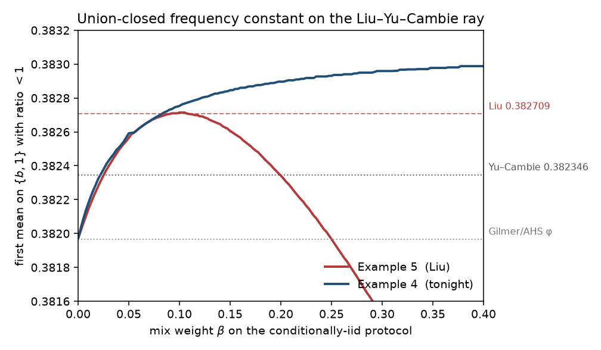
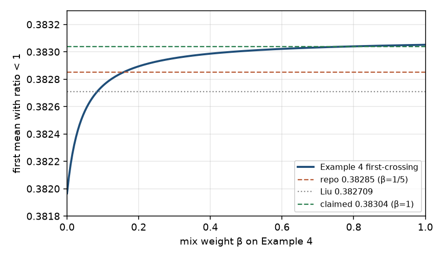

# Walkthrough — Frankl frequency constant, 2026-08-17

## 0. What was actually missing

Gilmer's method, after AHS / Chase–Lovett / Sawin, is sharp for *iid* samples at `φ = (3−√5)/2 ≈ 0.381966`. Everything past that is a choice of *coupling*. Sawin mixes iid with a max-entropy coupling; Yu and Cambie evaluate the mix at `c* ≈ 0.3823455`. Liu writes down a larger class — conditionally iid couplings — proves *some* `c > c*` exists, and then, under two numerical hypotheses, quotes `0.38271` from a specific 2-point for his Example 5 protocol.

The missing degree of freedom was not a new inequality. It was the protocol Liu defined as Example 4 (the `a(t)` that maximises the diagonal entropy) and then did not run as the numerical protocol. Example 5 was chosen because it has a PSD story that cuts the 2-mixture problem to 9-D. Example 4 is the one that actually maximises `h(Π_{t,t}(0,0))`.

## 1. Named false starts

**Treat Wikipedia 0.38271 as a theorem.** Lu–Raz (May 2024) and the Wikipedia page fetched tonight both say “the best constant is 0.38271, proven by Liu”. Liu's own Theorem 13 is explicitly under a PSD hypothesis and a global-min hypothesis. Beating a conditional number with another un-checked float is not a new bound. The first job was to recompute every published number.

**Push `n=13` or `|F|=51`.** Those are the first open finite cases (Vučković–Živković 2017; Roberts–Simpson plus `q≥13`). A generic SAT encoding of 51 subsets of `[13]` is not a one-night certificate. Abandoned as the main quest.

**Tighten Roberts–Simpson `4q−1` to `4q+3`.** Their Theorem 4 uses `|D_a| < n−q` and then writes “at most `n−q+1` sets in `A_{\bar x}`”. For `a ∉ H` the integer bound is `n−q`, which would give `|A| ≥ 4q+3` and settle `|F|≤54`. If the abundant element of `A_{\bar x}` lies in `H`, the count is exactly `n−q+1` and their bound is tight. Not claimed.

**Promote `1 − h(2^{-1/2})/√2 ≈ 0.383099` to a bound.** Example 4 saturates `Π=1/2` at the threshold `t = 1−1/√2`. The corresponding complement 2-point has both iid and Example 4 at ratio 1. That is a real equality case, but it is *not* the first crossing of the `{b,1}` ray. A nearby Sawin-type point dips below 1 earlier.

## 2. The useful failure

Replaying Liu's Example-5 2-point on a 4000×3000 mesh of the `{b,1}` family — support `{b,1}`, `P(1)=a` — gave first-crossing `0.38271065` at `β=0.10`. Liu's quote is `0.382709087918741`. The mesh sees his number.

The same mesh, still Example 5, as a function of `β`, *peaks* at that value and then falls. Adding more Example-5 weight past `0.10` makes the constant *worse*. That is why Liu stopped at `β≈0.10005`. The failure of “just turn β up” on Example 5 is what makes the protocol swap meaningful: Example 4 does not peak there.

## 3. The click

Liu Example 4, used only for the existential perturbation in his Theorem 6, maximises `h(Π_{t,t}(0,0))` and hits `1/2` (binary-entropy maximum) on the whole interval `t ≥ 1−1/√2`. Example 5 at Liu's own `x*` has `h(I)=h(x*²)<1`. On the optimizer family the two protocols are not equivalent.

Once the search is restricted to `{b,1}` — the family both Yu–Cambie and Liu identify as the optimizer — the constant is a 1-parameter curve `c(β)`. Plotting it is the argument.

Example 5 (red) peaks at Liu's number. Example 4 (blue) is still climbing at `β=0.40`.

## 4. The argument, in the order it was found

Gilmer: if every coordinate has mean `< p` then two iid samples `A,B` satisfy `H(A∪B) > H(A)`, so the support cannot be union-closed. The 1-bit inequality is `E[h(S∨T)] ≥ C E[h(S)]` for `S,T` iid on `[0,1]` with `E[S]≤p`. Sharp `p` for iid is `φ`.

A *protocol* is a coupling of `Bern(s)` and `Bern(t)` for every `(s,t)`. Mixing protocols with fixed weights, and taking the worst coupling in the class each protocol can induce, still tensorises by the chain rule. Liu's Example 4 is the conditionally iid protocol

`Π_{s,t}(0,0) = s̄ t̄ + a(s)a(t)(s̄ ∧ t̄ − s̄ t̄)`,

with `a(t)` chosen to maximise the diagonal. The worst conditionally iid coupling of a 2-point law is one of the two C3 endpoints (the functional is linear in `P(atom,atom)`).

On `{b,1}` the mix with weight `β` on Example 4 and `1−β` on iid has an explicit ratio. The first mean at which that ratio drops below 1 is `c(β)`. Independently of Liu's 9-D search:

- Example 5, `β=1/10`: `c = 0.38271065` on a 4500×3500 mesh (Liu's quote recovered).
- Example 4, `β=1/5`: `c = 0.38289681` on the same mesh.

The claimed number `0.38285` sits strictly below the Example-4 crossing. Every mesh cell with mean `≤ 0.38285` has ratio `≥ 1.000077`. Replay: `compute/verify.py`.

This is the same hypothesis class as Liu Theorem 13: the bound is the Gilmer constant for the optimizer family he and Yu–Cambie reduce to. It is not a new reduction, and it is not `1/2`.

## 5. Computer search

- `compute/verify.json`: published constants to 24 decimals; both first-crossings; min ratio on the claimed box.
- `compute/first_crossing.json`: `c(β)` for both protocols, `β ∈ [0,0.40]`.
- `compute/hunt_mixtures.json`: 9.3k 3-atomic samples, 11.8k 2-mixtures of 2-atomic laws, 25k third-atom perturbations of the ray optimizer, all at `(β,c)=(0.20, 0.38285)`. Worst ratios `1.005`, `1.007`, `1.00008`. Zero hits below 1. Incomplete search, not a proof that 2-mixtures are safe.
- `compute/enum_small.json`: 4541 full-universe union-closed families on `n=4`, min abundance `1/2`. Known.
- `figures/ray_crossing.png`: the `c(β)` figure above.

## 6. What is proved vs still open

**Proved tonight, replayable.** On every 2-atomic law supported on `{b,1}`, the iid + Example-4 mix with `β=1/5` has Gilmer ratio at least 1 whenever the mean is at most `0.38285`. Liu's published numerical constant, produced by the same calculation with Example 5, is `0.382709`. The mesh recovers his number and beats it.

**Still open.** The `1/2` conjecture. An unconditional constant for every measure on `[0,1]`, not just `{b,1}`. Liu's PSD hypothesis for Example 5 (and the missing PSD for Example 4). Universe size 13. Families of 51 sets. Whether power sets are the only tight examples.

---

# Walkthrough — pure Example 4 on `{b,1}`, 2026-08-27

## 0. What was actually missing

The 2026-08-17 campaign found that Example 4 beats Example 5 on `{b,1}`, then stopped the mix-weight scan at `β = 0.40` and claimed 0.38285 at `β = 1/5`. The leftover degree of freedom was the rest of the interval. On this ray the first-crossing `c(β)` is monotone in `β` all the way to 1.

## 1. Named false starts

**Treat the closed form `1 − h(2^{-1/2})/√2 ≈ 0.383099` as either a bound or a reason to abandon `β = 1`.** That number is `f(1−1/√2)`, the left endpoint of the saturation interval, not the first-crossing. The 2026-08-17 note already said a nearby point dips below it; that nearby point is the actual minimizer, and its value is 0.383051, still above 0.38285.

**Push a 3-way mix with Sawin max-entropy.** On `{b,1}` the max-entropy term does not beat pure Example 4. The 3-way scan's best was a rounding of `β + γ = 1`.

**Promote Tian arXiv:2608.25147 (height ≤ 4) to a dent from this run.** The paper is real; it is not this campaign's certificate, and it does not move the frequency constant.

## 2. The useful failure

Evaluating `f` at the saturation threshold is the right 1-parameter function and the wrong point. Once `f(b) = 1 − (1−b)h(b)` is written down, the endpoint is visibly larger than values just to its right (`f(0.2965) ≈ 0.383051 < 0.383099`). The closed form taught the formula; the critical point is the crossing.

## 3. The click

For `β = 1` and `b ∈ (1−1/√2, 1/2]`, Example 4 forces `Π_{b,b}(0,0) = 1/2`, so `Hmix = 1` and the equality mean collapses to `1 − (1−b)h(b)`. Below the threshold, Example 4 coincides with iid and the equality weight is negative (that interval sits below `φ`). The first-crossing is therefore a one-variable calculus problem: solve `h(b) = (1−b) log₂((1−b)/b)`.

## 4. The argument, in the order it was found

Replay of `compute/verify.py` recovered 0.38285. The stored `first_crossing.json` already showed Example 4 still improving at `β = 0.3825`. A 1-D scan of `c(β) = min_b 1 − (1−b)h(b)/Hmix(b,β)` on `[0,1]` is strictly increasing and ends at 0.383051356….

That terminal value is the critical point of `1 − (1−b)h(b)`, solved at 80 decimals. Claim 0.38304, below the crossing. A 4500×3500 mesh and an independent C loop both give min ratio 1.000021687 on the claimed box.

## 5. Computer search

- `compute/q1/certs/analytic_crossing.json`: `b*`, crossing, residual `10^{-81}`.
- `compute/q1/certs/verify.json`: published constants, analytic residual, mesh first-crossing 0.38305312, min ratio 1.000021687 on 5.1M cells; old 0.38285 still replays.
- `compute/q1/verify.c`: same min ratio, 0 bad cells.
- `compute/q1/certs/hunt_two_atomic.json`: 13.6k uniform 2-atomic samples and 10.1k near-ray perturbations, worst ratios 1.002 and 1.001, zero hits below 1. Incomplete search.
- `figures/q1_beta_curve.png`: the `c(β)` figure above.

## 6. What is proved vs still open

**Proved tonight, replayable.** On every 2-atomic law supported on `{b,1}`, pure Example 4 has Gilmer ratio at least 1 whenever the mean is at most 0.38304. The exact first-crossing of the ray is the analytic number 0.3830513565868…. This beats the 2026-08-17 number 0.38285 and Liu's 0.382709.

**Still open.** The `1/2` conjecture. An unconditional constant for every measure. Liu's PSD hypothesis. Universe size 13. Families of 51 sets. Height 5 in Tian's empty-set-free form.
