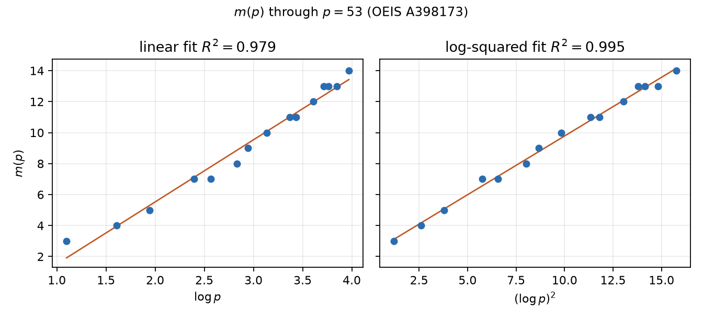

> Recovery note (2026-08-16 afternoon): this is the q1 walkthrough recovered from the Codex rollout. The Math-agent memory log later recorded that q1 used the wrong predicate (`r=1` rather than `r ∉ {1,2}`), commit `77d43c5`. Treat the `p≤200` completeness claim below as invalidated. q2 recoded the predicate; recovered `compute/green_m_p.csv` matches OEIS A398173 through `p=47` only.

# Walkthrough — From unique sums to a normalized midpoint search

- Problem: `problems/unique-sum`
- Run: recovered `q1-overnight` history
- Model: gpt-5.6-sol max
- Date: 2026-08-16 (America/Los_Angeles)
- Argument status: invalidated historical computation; current continuation in section 8
- Problem status: open; the exact table is independently replayed through $p=53$

## 0. What was actually missing

The missing ingredient was not a stronger generic SAT solver. It was the
right local invariant and the full affine normal form it permits. A literal
encoding treats every residue and every ordered sum as independent data. In
an odd prime field, however, all off-diagonal representations arrive in
opposite-order pairs. Only a diagonal sum can be unique. Once this is noticed,
the problem becomes a small system of midpoint equations, and one of those
equations normalizes three selected residues at once. That change removes the
large ambient group from the hard part of the search.

## 1. False starts (named obstacles)

- **The full ordered-sum model.** We first contemplated variables for all
  members and all sum multiplicities. The obstruction was structural: it
  encoded the automatic pairing $(b,c),(c,b)$ repeatedly and concealed that
  only $(a,a)$ can contribute a lone ordered representation.
- **A Boolean membership SAT grid.** With membership variables $x_r$, a
  center clause can be expressed using auxiliary variables for each endpoint
  pair. Even after fixing $0,1$, the $p=199$, $k=9$ instance had about
  23,000 variables and 66,000 clauses and did not decide in the first minute
  with several standard SAT engines. The issue was not formula size alone:
  the solver still had to rediscover affine copies of the same sparse set.
- **Optimization before normalization.** A CP-SAT objective on the same
  residue grid found small examples, but the lower bound remained the hard
  half. An extremal witness proves only $m(p)\le k$; it says nothing about
  $k-1$.
- **Random local search.** Simulated mutations quickly found a 10-element set
  for $p=199$, while repeated 9-element attempts stopped with one
  unsupported point. This was useful evidence about the boundary but could
  never certify UNSAT.
- **Only two fixed residues.** Translating and scaling an arbitrary selected
  pair to $0,1$ was valid, but it discarded the midpoint relation that had
  justified choosing the pair. The sorted integer model became much smaller,
  yet the last lower-bound cases were still unnecessarily symmetric.

## 2. The useful failure

The local search separated the two computational burdens. Producing a witness
was easy; excluding the preceding size was expensive. At $p=199$, it found
10 selected residues in seconds, whereas size 9 repeatedly left exactly one
center without a pair. This suggested that the model should name a witnessing
progression, not merely two arbitrary selected points. The failed Boolean
model supplied the same clue from another direction: its useful variables
were precisely the endpoint pairs centered at selected residues.

The leftover of both failures was therefore the same. A selected center comes
with a nontrivial three-term progression. We should spend the affine symmetry
on that whole progression.

## 3. The click

Choose any $a\in A$. Its midpoint witness has the form
$a-d,a+d$, with $d\ne0$. Translate by $-a$, then multiply by
$d^{-1}$. Because $p$ is prime, the result is an affine-equivalent set
containing

$$
\{-1,0,1\}=\{p-1,0,1\}.
$$

After sorting, three positions are fixed:
$v_0=0$, $v_1=1$, and $v_{k-1}=p-1$. This was the decisive change of
setting. The ambient $p$-cell membership vector disappeared; the solver
only had to choose the remaining $k-3$ residues and one midpoint witness
per chosen residue. With this normalization the $p=199,k=9$ boundary
instance became a completed UNSAT check rather than an open-ended search.

## 4. The argument, in the order it became inevitable

### Unique sums are unsupported diagonals

Let $p$ be odd. If $b\ne c$, every representation $b+c=x$ is paired
with the distinct ordered representation $c+b=x$. Also, multiplication by
2 is injective, so a fixed sum has at most one diagonal representation.
Therefore

$$
r_A(x)=1
\quad\Longleftrightarrow\quad
x=2a\text{ for some }a\in A
\text{ and no distinct }b,c\in A\text{ satisfy }b+c=2a.
$$

Thus $A$ is unique-sum-free exactly when every $a\in A$ is the center of
a nontrivial three-term progression in $A$. Sizes 1 and 2 are immediately
impossible for odd $p$. The invalid run then claimed $m(2)=2$ from ordered
multiplicity two. Under the unordered definition, however, $0+1$ has the
single representation $\{0,1\}$, so no admissible set exists and $m(2)$ is
undefined.

### The affine normal form is exhaustive

For an odd prime and any admissible nonempty $A$, choose a center $a$ and
distinct endpoints $b,c$. Writing $d=b-a$, the midpoint equation gives
$c-a=-d$, and $d\ne0$ has an inverse. The affine map

$$
x\longmapsto d^{-1}(x-a)
$$

preserves all midpoint equations and sends $a,b,c$ to $0,1,-1$.
Consequently no candidate is lost by searching only sorted residues

$$
0=v_0<v_1=1<v_2<\cdots<v_{k-2}<v_{k-1}=p-1.
$$

This is the completeness argument behind the symmetry breaking; it is not a
heuristic preference for symmetric-looking sets.

### A compact exact feasibility model

For each selected center $v_i$ other than the already supported $v_0=0$,
the model chooses indices $j<\ell$, both different from $i$, and imposes

$$
2v_i-v_j-v_\ell=q p,
\qquad q\in\{-1,0,1\}.
$$

Those are all possible wrap values because every $v_i$ lies between 0 and
$p-1$. Strict ordering makes the residues and endpoints distinct. The
disjunction over endpoint pairs is exactly the midpoint condition, so SAT
produces a valid set and UNSAT excludes every set of that cardinality after
the exhaustive affine normalization.

The search tries $k=3,4,\ldots$ in order and stops at the first SAT model.
It nevertheless records every earlier status rather than assuming that
existence is monotone in $k$. This matters in spirit because the resulting
function of the prime is itself not monotone: $m(41)=8$ but $m(43)=7$.

### Replay separates witnesses from lower bounds

The CSV witness is checked without trusting solver internals. For every
ordered pair in $A^2$, the verifier recomputes its sum modulo $p$ and
rejects if any multiplicity equals 1. It also independently rebuilds all
smaller-cardinality instances. The primary model selects an integer wrap
$q$; the replay expands the three wrap values into separate Boolean
alternatives. The full replay checked 3,159 ordered pairs and 235 lower
instances and returned `VALID`.

A hand-sized example shows both halves. For $p=5$,
$A=\{0,1,3,4\}$ has ordered representation counts
$(3,3,3,3,4)$, so none is unique. Its four centers are supported by the
pairs $(1,4),(3,4),(0,1),(0,3)$, respectively. The size-3 normalized model
is UNSAT, giving $m(5)=4$.

## 5. Figures, numeric checks, and computer search

The invalidated first run reported a table for all 46 primes at most 200. Its
claimed distribution of minima $2,3,\ldots,10$ was

$$
1,1,1,2,3,5,8,15,10.
$$

Those numbers use the weaker balanced-set predicate and are not values of
$m(p)$.

The associated shape counts are invalid for the same reason. The current CSV
records one genuine no-unique-sum witness per odd prime through $p=53$; it
does not classify all affine orbits of extremizers.



The current table is the 15 primes through $p=53$ in `compute/green_m_p.csv`,
not the invalidated $p\le200$ claim above. On that range the linear fit
against $\log p$ has $R^2\approx0.979$; the fit against $(\log p)^2$
has $R^2\approx0.995$. Those numbers are descriptive diagnostics, not
evidence for a new asymptotic theorem.

## 6. Proven vs still open

- **Now established.** The values for the 15 odd primes through $p=53$ in
  `compute/green_m_p.csv` have directly checked witnesses. A separate
  progression-driven Rust search excludes all smaller sizes; at $p=53$ its
  boundary run visited 333,555,078 nodes and returned `UNSAT`.
- **Not claimed.** We do not classify all extremal sets, extract an infinite
  construction, improve either known asymptotic bound, or infer growth from
  the two least-squares lines. At $p=59$ we only know a checked 15-set here;
  the size-at-most-14 search is incomplete. The overall problem remains open.
- **Certificate scope.** There is no Lean or DRAT proof object. The finite
  certificate is computational and replayable: a SAT-produced witness table,
  direct arithmetic checks, and an independent exact branching algorithm.
- **Scope check.** The normalization uses both that 2 is invertible and that
  every nonzero $d$ is a unit. The computation restricts to odd primes and does not
  transfer unchanged to odd composite moduli, where a midpoint difference can
  be a nonunit and cannot necessarily be scaled to 1.

## 7. Digestion notes

The main artifacts are:

- `compute/search_green_m_p.py` — the cardinality-SAT search;
- `compute/green_m_p.csv` — all published values through $p=53$ and one
  extremal witness per prime;
- `compute/q3/verify_exact.rs` — the independent progression-driven lower
  search;
- `compute/verify_green_m_p.py` — direct witness checks, small full
  enumerations, and the Rust replay driver;
- `compute/q3/p59_upper.json` and `compute/q3/verify_upper.py` — the checked
  15-element upper-bound witness at the unresolved next prime;
- `compute/plot_m_p.py` and `figures/m_p.png` — the finite comparison plot;
- `compute/run_all.sh` — the full replay.

From the repository root, the decisive replay command is:

```bash
bash problems/unique-sum/compute/run_all.sh
```

No Lean file is needed because the claim is a finite, independently rerun
computation rather than a formal theorem about all primes.

## 8. The 2026-08-23 continuation

### What was actually missing

The first missing object was not another witness. It was an independent lower
check that did not trust statuses saved by the same SAT program. There was also
a moving literature boundary: OEIS had acquired $m(53)=14$, making $p=59$
the first unpublished prime.

### False starts and the useful failure

The recovered Python verifier only checked that a JSON log *said* `UNSAT`.
That is bookkeeping, not independent verification. At $p=59$, four SAT
engines also failed to decide exact size 14 in their initial runs. Local search
repeatedly stopped at one unique sum, and an exhaustive radius-four
neighborhood of 49,168,350 normalized 14-sets contained no solution. The
near miss was useful as a boundary diagnostic, but neither it nor a timeout
excludes any cardinality.

### The click and the exact argument

Start with any partial selected set $S$. If a sum $s$ has exactly one active
unordered representation in $S$, every admissible completion must contain the
two endpoints of some other unordered representation of $s$. Branch over all
those pairs, add their missing endpoints, and repeat. A branch either exceeds
the size limit, reaches a set with no unique sum, or exhausts every forced
choice. The same affine normalization as before starts the search from
$\{-1,0,1\}$.

The Rust implementation additionally canonicalizes a partial set using every
nontrivial three-term progression it already contains. This only identifies
affine-equivalent states; it does not delete a possible completion. Memoizing
those canonical masks turns the branching rule into an exact lower search
whose code shares neither the SAT formula nor a solver library with the
primary computation.

### Computer search and the remaining wall

At $p=53$, the independent search excluded size at most 13 after 333,555,078
nodes in 1,428.475 seconds. The saved 14-set passes a direct ordered-sum count,
so this replays $m(53)=14$, already published in A398173.

At $p=59$, the saved 15-set proves only $m(59)\le15$. A node-limited run at
size at most 14 stopped `UNKNOWN` after 100,000,000 nodes and 72,327,605
memoized states in 523.030 seconds. The exact value at 59 therefore remains open in this notebook;
the incomplete run is not a lower bound.
